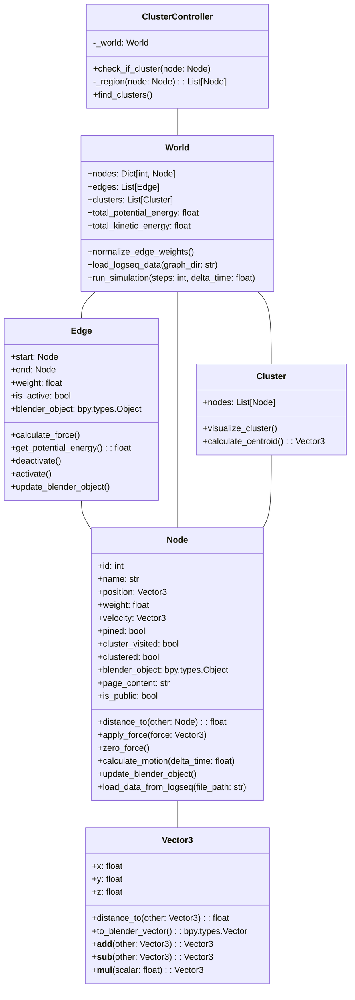
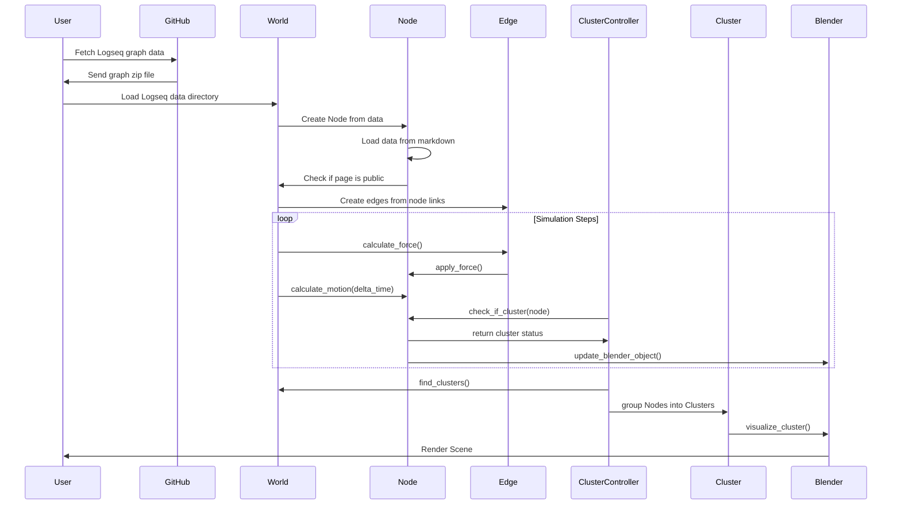
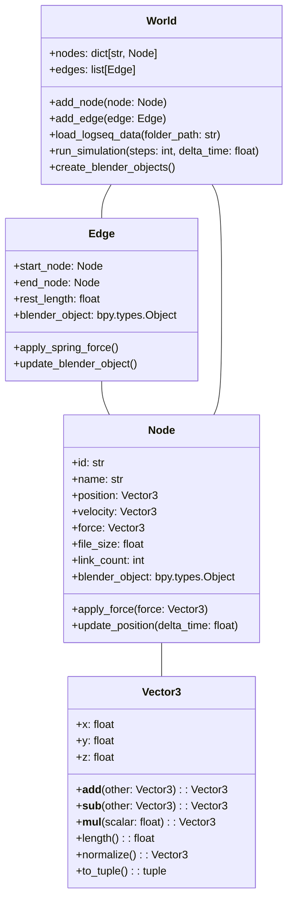
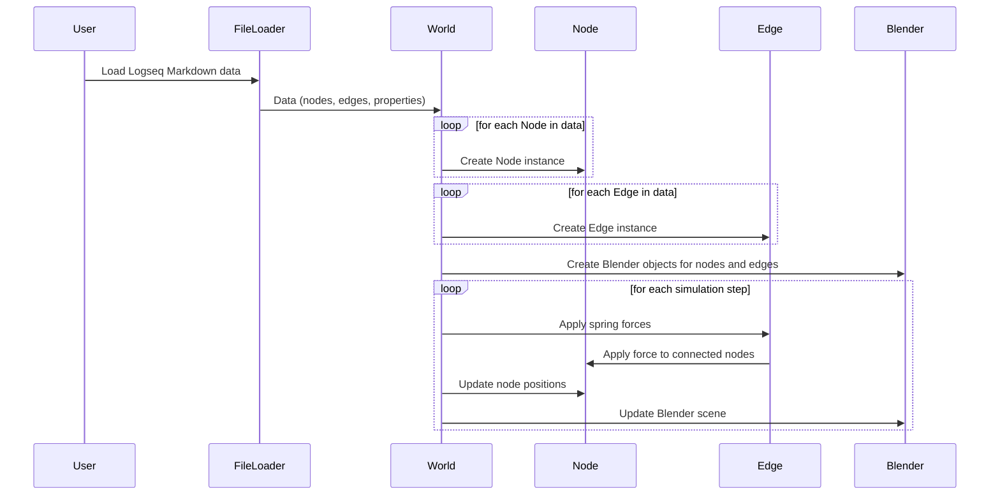

This is the github from the experiment described in this LinkedIn blog post.
https://www.linkedin.com/feed/update/urn:li:activity:7208897952885436416

The code provided is a good starting point for building an immersive spatial knowledge graph using Blender and Python. Let's go through the main components and discuss their roles:

1. `Vector3` class: This class represents a simple 3D vector and provides methods for calculating the distance between vectors and converting to Blender's built-in `Vector` type. It serves as a basic building block for positioning nodes in 3D space.

2. `Node` class: This class represents a node in your Logseq graph. It contains properties such as `id`, `name`, `position`, `weight`, `velocity`, and `pined`. It also includes methods for calculating distances between nodes, updating motion based on forces, and updating the corresponding Blender object. You can add additional properties specific to Logseq, such as `block_content` and `link_types`, to store relevant data from Logseq.

3. `Edge` class: This class represents a connection between nodes in your Logseq graph. It contains properties such as `start` and `end` nodes, `weight`, and `is_active`. It also includes methods for calculating forces based on Logseq data, calculating potential energy, activating/deactivating the edge, and updating the corresponding Blender object. You can add Logseq-specific properties like `link_type` to store the type of Logseq link.

4. `World` class: This class holds the entire graph data, including nodes, edges, and clusters. It provides methods for normalizing edge weights and calculating total potential and kinetic energy. You can expand this class to include additional global calculations or data management.

5. `Cluster` class: This class represents a cluster of interconnected nodes. It contains a list of nodes and can be expanded to include properties or methods for visualizing clusters in Blender.

6. `ClusterController` class: This class handles cluster detection. It takes a `World` instance and provides methods for checking if a node belongs to a cluster and finding the region of connected nodes.

The code also includes an example of how to use these classes in Blender. It demonstrates creating Blender objects for nodes and edges, performing cluster detection, and running a physics simulation loop to update node positions based on forces.

To further develop this project, you can consider the following steps:

1. Integrate with Logseq: Implement methods to load nodes and edges from Logseq data into your `World` instance. This may involve parsing Logseq's data format and mapping it to your `Node` and `Edge` classes.

2. Enhance physics simulation: Implement more sophisticated physics calculations for forces, motion, and energy. You can consider using libraries like Bullet Physics or writing your own physics engine tailored to your specific requirements.

3. Improve visualization: Customize the appearance of nodes and edges in Blender based on Logseq data. You can assign different colors, sizes, or shapes to nodes and edges based on their properties or link types.

4. Implement user interaction: Add mechanisms for users to interact with the spatial knowledge graph in Blender, such as selecting nodes, filtering edges, or manipulating the graph layout.

5. Optimize performance: As your graph grows in size, you may need to optimize the performance of your code. This can involve using efficient data structures, parallelizing computations, or employing spatial partitioning techniques like octrees or BSP trees.

Remember to iteratively test and refine your code as you add new features and integrate with Logseq. This project has the potential to provide a visually immersive and interactive way to explore and navigate knowledge graphs.

### Diagrams

#### Updated Class Diagram:

#### Sequence Diagram:

Below is the sequence diagram showing the process flow, including fetching Logseq data from GitHub, parsing nodes, and running the simulation.

### Description
- **Fetching Logseq Graph Data**: The function `fetch_logseq_data_from_github` downloads and extracts Logseq graph data from a GitHub repository.
- **Public Page Detection**: The function `is_page_public` determines if a page is public by examining the content of the markdown file.
- **Vector3 Class**: Represents a 3D vector with basic mathematical operations.
- **Node Class**: Represents a node in the graph, including loading data from a Logseq markdown file and determining if it is public.
- **Edge Class**: Represents an edge in the graph with placeholders for force calculations and potential energy.
- **World Class**: Manages the entire graph data, loads Logseq data, and runs the physics simulation.
- **Cluster and ClusterController Classes**: Manage the detection and representation of clusters within the graph.
- **Blender Integration**: Creates Blender objects for each node and runs a simulation to update their positions.

### Next Steps
1. **Implement Edge Creation Logic**: Extract link information from node markdown content and create `Edge` objects.
2. **Test and Validate**: Continuously test the complete workflow from GitHub data fetching to visualization in Blender.
3. **Explore Omniverse API**: Once basic functionality is working in Blender, integrate Omniverse for advanced features like materials, physics, and collaboration.

File Structure: Organize your Python code into multiple files: vector3.py, node.py, edge.py, world.py, file_loader.py (or similar names).
Mapping C# Components to Python Functions:
VSCode.cs:
SyncSolution(), UpdateSolution(): These functionalities are likely not needed in Blender as you'll interact directly with the scene.
CallVSCode(): Replace this with Blender-specific scene update functions.
ScrubSolutionContent(), ScrubProjectContent(), ScrubFile(): These are likely not needed in Python.
VSCodePreferencesItem(): Replace with a Blender UI panel if you need custom settings.
OnOpenedAsset(): Not directly applicable, but you might have similar logic for interacting with nodes in Blender.
CheckForUpdate(), InstallUnityDebugger(): Not needed in Python.
OnPlaymodeStateChanged(), OnScriptReload(): Blender has different event mechanisms for scene updates.
WriteWorkspaceSettings(): Not needed in Python.
World.cs:
NormalizeEdgeWeights(): Port this logic to the World class in Python.
CenterCamera(): Implement using Blender's camera API.
Event handling will need adaptation to Blender's mechanisms.
Node.cs, Edge.cs, Spring.cs, Cluster.cs, ClusterController.cs:
Create equivalent classes in Python with similar functionalities.
Adapt force calculations and spring behavior to work with Blender's physics.
ThreadDistributer.cs, Parsers, VRActionResponder.cs:
Port ThreadDistributer if you need multithreading in Python.
Implement parsing logic for Logseq Markdown files in Python.
Adapt interaction code to use Omniverse's VR input framework.
