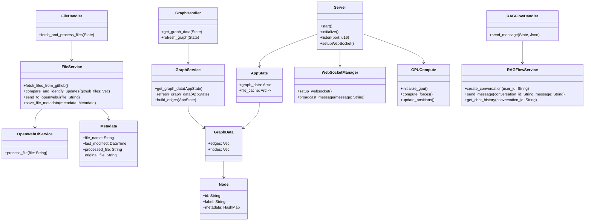
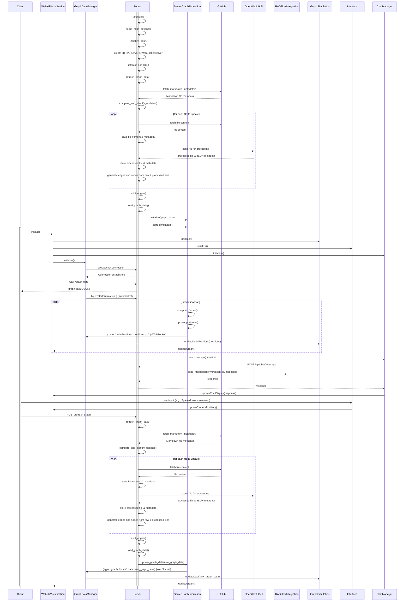

# WebXR Graph Visualization of Logseq Knowledge Graphs with RAGFlow Integration

This project visualises privately hosted GitHub Markdown files created by LogSeq and integrates with RAGFlow for question-answering capabilities in a 3D, WebXR-compatible environment.


## Project Overview

This application transforms a LogSeq personal knowledge base into an interactive 3D graph, viewable in mixed reality. It automatically parses pages from a private GitHub repository, processes them via OpenWebUI, and creates a force-directed 3D graph using WebXR and Three.js. The processed and raw files are analysed, and JSON metadata is generated for both versions, enabling a comparison of graph nodes and edges.

Key features include:
- **3D Visualisation** of knowledge graph nodes and edges
- **WebXR Compatibility** for immersive exploration
- **OpenWebUI API Integration** for file pre-processing
- **Integration with RAGFlow** for AI-powered question answering
- **Real-Time Updates** via WebSocket for both client and server
- **Mandatory GPU Acceleration** on the server-side for graph computations using WebGPU
- **Optional GPU Acceleration** on the client-side for enhanced performance
- **One-Time File Pre-Processing** for GitHub file updates, comparing processed and raw files

## Architecture

The project consists of a Rust-based server running in a Docker container and a JavaScript client-side application.

### Class Diagram



### Sequence Diagram



## File Structure

### Server-Side (Rust)

- **src/**
  - `main.rs`: Entry point for the Rust server
  - `app_state.rs`: Shared application state
  - `handlers/`
    - `graph_handler.rs`: Handles graph data requests
    - `file_handler.rs`: Manages file operations and GitHub interactions
    - `ragflow_handler.rs`: Handles RAGFlow API interactions
  - `services/`
    - `graph_service.rs`: Core graph processing and management
    - `file_service.rs`: File handling and OpenWebUI integration
    - `ragflow_service.rs`: RAGFlow conversation management
    - `openwebui_service.rs`: Interaction with OpenWebUI API
  - `models/`
    - `graph.rs`: Graph data structures
    - `metadata.rs`: File metadata representation
    - `node.rs`: Graph node structure
  - `utils/`
    - `websocket_manager.rs`: Server-side WebSocket management
    - `gpu_compute.rs`: GPU acceleration for server-side computations using WebGPU

### Client-Side (JavaScript)

- **Core**: `public/js/`
  - `index.js`: Entry point for client-side application
  - `app.js`: Main application setup and initialization

- **Components**: `public/js/components/`
  - `webXRVisualization.js`: Manages WebXR rendering and interactions
  - `graphSimulation.js`: Handles graph physics and layout
  - `interface.js`: User input handling
  - `chatManager.js`: Manages chat interface and RAGFlow interactions

- **Services**: `public/js/services/`
 

 - `graphDataManager.js`: Manages graph data and WebSocket communication
  - `websocketService.js`: Client-side WebSocket handling

- **ThreeJS Components**: `public/js/threeJS/`
  - `threeSetup.js`: Three.js scene initialization
  - `threeGraph.js`: Three.js graph rendering

- **XR Components**: `public/js/xr/`
  - `xrSetup.js`: WebXR session setup
  - `xrInteraction.js`: XR-specific interaction handling

- **Utilities**: `public/js/`
  - `gpuUtils.js`: Optional GPU acceleration for client-side computations

### Tests

Unit tests are provided for all major components, both on the server and client side, under the `tests` directory.

## Installation and Setup

### Prerequisites

- Docker
- Rust (for local development)
- GitHub Personal Access Token
- RAGFlow API Key
- OpenWebUI API
- GPU-enabled server for mandatory server-side acceleration
- (Optional) GPU-enabled client device for enhanced performance

### Environment Setup

1. Clone the repository:
   ```bash
   git clone https://github.com/yourusername/webxr-graph.git
   cd webxr-graph
   ```

2. Create a `.env` file in the root directory:
   ```
   GITHUB_ACCESS_TOKEN=your_token_here
   GITHUB_OWNER=your_github_username
   GITHUB_REPO=your_repo_name
   GITHUB_DIRECTORY=path/to/markdown/files
   RAGFLOW_API_KEY=your_ragflow_api_key_here
   RAGFLOW_BASE_URL=http://your_ragflow_base_url/v1/
   OPENWEBUI_API=http://your_openwebui_url/
   ```

3. Build and run with Docker:
   ```bash
   docker build -t webxr-graph .
   docker run -p 8443:8443 --gpus all webxr-graph
   ```

4. Access the application at `https://localhost:8443` using a WebXR-compatible browser.

## Development Status

The project is under active development. Areas of focus include:
- Optimising WebGPU integration for graph computations
- Finalising the integration with OpenWebUI for file processing
- Expanding unit tests and improving test coverage
- Enhancing the Rust-based server performance

## Contributing

Contributions are welcome! Please submit issues or pull requests.

## License

This project is licensed under the Creative Commons CC0 license.

---
