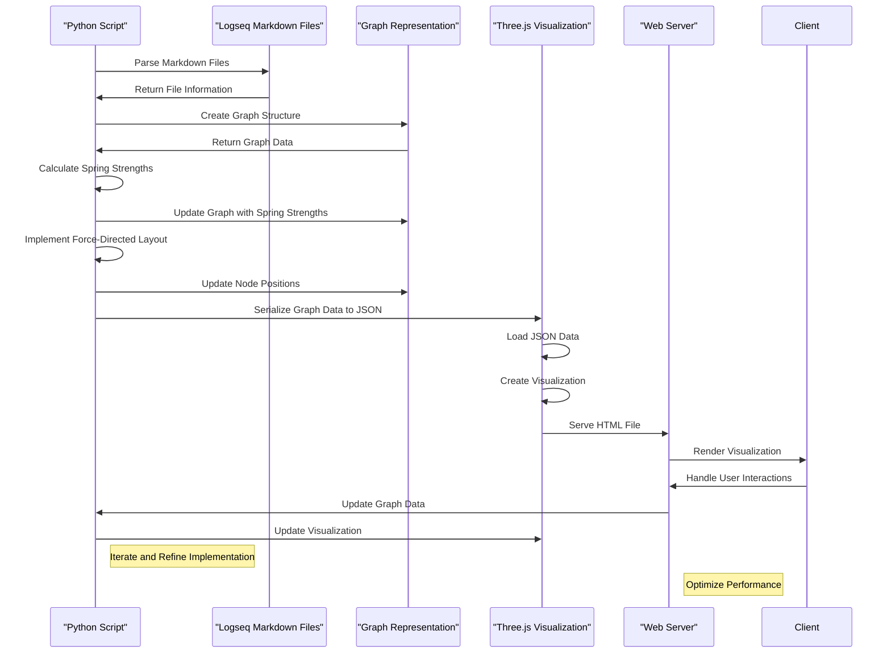

# JingSpringThing

### ASSISTANT
Here is a Mermaid sequence diagram for the project idea:

This sequence diagram illustrates the key steps and interactions involved in the project, including parsing markdown files, creating a graph representation, calculating spring strengths, implementing a force-directed layout, serializing data for Three.js, rendering the visualization, and handling user interactions.

### USER
ok, now the class diagrams

### ASSISTANT
Class diagrams are a crucial part of the Unified Modeling Language (UML) used in software engineering to visualize and design systems. Here are the key points about class diagrams:

### Key Components of a Class Diagram
- **Classes**: Represented by rectangles, classes are the blueprints for objects. They describe the type of objects, including their attributes and methods.
- **Attributes**: These are the data elements that describe each instance of a class. They are listed in the middle section of the class rectangle and are formatted as "attributeName: attributeType".
- **Methods**: Also known as operations or functions, methods are listed in the bottom section of the class rectangle. They specify the actions that can be performed on objects of the class.
- **Visibility**: Indicated by symbols (+, -, #) before attribute and method names, visibility denotes whether they are public, private, or protected.

### Relationships Between Classes
- **Inheritance**: A child class inherits all attributes and methods from a parent class.
- **Association**: A basic relationship where there is no dependency between classes.
- **Aggregation**: A part can exist outside the whole.
- **Composition**: A part cannot exist outside the whole.
- **Dependency**: An object of one class uses an object of another class in a method, but the object is not stored in any field.

### Usage in Software Development
- **Design and Modeling**: Class diagrams are used to model software in a high level of abstraction, helping to understand the structure of a system without looking at the source code.
- **Communication**: They facilitate communication among developers by providing a standard way to visualize and describe the design of a system.
- **Analysis**: Class diagrams are used to analyze and think about the system design before coding, ensuring that the design is well-planned and efficient.

### Tools and Resources
- **Lucidchart**: A tool for creating UML class diagrams with in-depth training and examples on inheritance, aggregation, and composition relationships.
- **Visual Paradigm**: A UML software that supports all UML diagram types, including class diagrams, and is free to use.

### Best Practices
- **Use Before Coding**: Creating class diagrams before writing code helps to clarify the design, reduces errors, and improves communication among developers.
- **Keep Diagrams Up-to-Date**: It is essential to update class diagrams as the code changes to ensure they remain accurate and useful.
