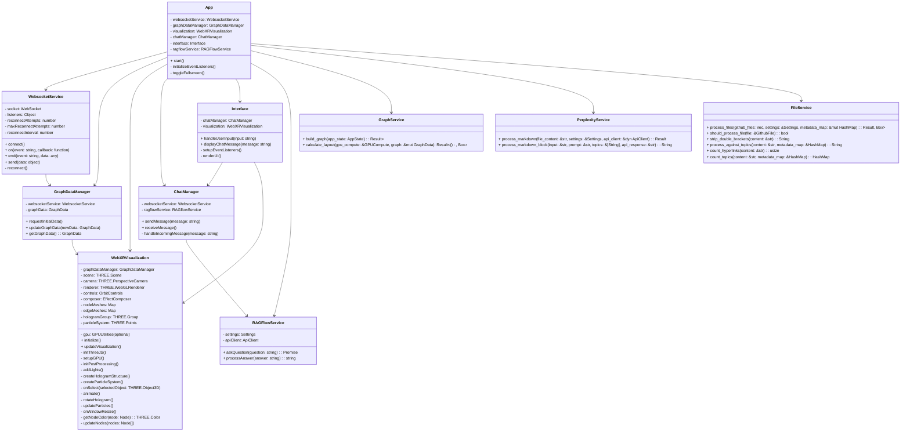

# WebXR Graph Visualization of Logseq Knowledge Graphs with RAGFlow Integration


Inspired by Prof Rob Aspin's work 
https://github.com/trebornipsa

Integrates Sonata rust wrapper for Piper
https://github.com/mush42/sonata


## Project Overview

The **WebXR Graph Visualization** project transforms a LogSeq personal knowledge base into an interactive 3D graph, accessible in mixed reality environments. The system automates the parsing of Markdown files from a privately hosted GitHub repository, enhances the content using the **Perplexity AI API**, and integrates with **RAGFlow** for AI-powered question answering. Processed changes are submitted back to the source repository as pull requests (PRs).

**Key Features:**

Inspired by Prof Rob Aspin's work 
https://github.com/trebornipsa

Integrates Sonata rust wrapper for Piper
https://github.com/mush42/sonata


- **3D Visualization:** Dynamic representation of knowledge graph nodes and edges with real-time updates.
- **WebXR Compatibility:** Immersive exploration on Augmented Reality (AR) and Virtual Reality (VR) devices.
- **Efficient WebSocket Communication:** Facilitates dynamic node position updates and real-time interactions.
- **GPU Acceleration:** Enhances performance on both server and client sides using WebGPU.
- **Node Labels as Billboards:** Clear and interactive identification of nodes within the graph.
- **Integration with RAGFlow:** Enables AI-powered question answering directly within the graph interface.
- **Spacemouse Support:** Offers intuitive navigation within immersive environments.
- **Automatic GitHub PR Submissions:** Streamlines the process of updating processed content back to GitHub.
- **Comprehensive Metadata Management:** Handles both processed and raw JSON metadata for enhanced data representation.

## Architecture

The project comprises a **Rust-based server** running within a Docker container and a **JavaScript client-side application**. The architecture emphasizes GPU acceleration, efficient real-time updates, and immersive AR experiences.

### Class Diagram



### Sequence Diagram

```mermaid
sequenceDiagram
    participant User
    participant Interface
    participant App
    participant WebsocketService
    participant GraphDataManager
    participant WebXRVisualization
    participant ChatManager
    participant RAGFlowService
    participant PerplexityService
    participant FileService
    participant GraphService
    participant APIClient
    participant GPUCompute
    participant Server

    rect rgba(200, 255, 200, 0.1)
        activate Server
        Server->>Server: Load env vars & settings (config.rs)
        alt Settings Load Error
            note right of Server: Error handling in main.rs
            Server-->>User: Error Response (500)
            deactivate Server
        else Settings Loaded
            Server->>Server: Initialize AppState (app_state.rs)
            Server->>Server: Initialize GPUCompute (utils/gpu_compute.rs)
            alt GPU Initialization Error
                note right of Server: Fallback to CPU calculation
            end
            Server->>Server: initialize_graph_data (main.rs)
            Server->>FileService: fetch_and_process_files (services/file_service.rs)
            activate FileService
                FileService->>GitHub: fetch_files (RealGitHubService::fetch_files)
                activate GitHub
                    GitHub-->>FileService: Files or Error
                deactivate GitHub
                alt GitHub Error
                    FileService-->>Server: Error
                else Files Fetched
                    loop For each file
                        FileService->>FileService: should_process_file
                        alt File needs processing
                            FileService->>PerplexityService: process_file (services/perplexity_service.rs)
                            activate PerplexityService
                                PerplexityService->>PerplexityService: process_markdown (splits into blocks, calls API)
                                PerplexityService->>PerplexityService: call_perplexity_api (multiple times)
                                PerplexityService-->>FileService: Processed content or Error
                            deactivate PerplexityService
                            alt Perplexity Error
                                FileService-->>Server: Error
                            else Content Processed
                                FileService->>FileService: save_file_metadata (writes to /app/data/markdown)
                            end
                        end
                    end
                    FileService-->>Server: Processed files or Error
                end
            deactivate FileService
            alt File Processing Error
                Server-->>Server: Error
            else Files Processed Successfully
                Server->>GraphService: build_graph (services/graph_service.rs)
                activate GraphService
                    GraphService->>GraphService: Create nodes and edges
                    GraphService->>GPUCompute: calculate_layout (or CPU fallback)
                    activate GPUCompute
                        GPUCompute->>GPUCompute: set_graph_data
                        GPUCompute->>GPUCompute: compute_forces
                        GPUCompute->>GPUCompute: get_updated_positions
                        GPUCompute-->>GraphService: Updated node positions
                    deactivate GPUCompute
                    GraphService-->>Server: GraphData
                deactivate GraphService
                Server->>WebsocketService: broadcast_graph_update (utils/websocket_manager.rs)
                activate WebsocketService
                    WebsocketService-->>User: graph_update_message
                deactivate WebsocketService
                Server-->>User: Success Response
            end
        end
    end

    note right of User: Initial load

    User->>WebXRVisualization: initialize()
    activate WebXRVisualization
        WebXRVisualization->>GraphDataManager: requestInitialData()
        activate GraphDataManager
            GraphDataManager->>WebsocketService: subscribe()
            WebsocketService-->>GraphDataManager: Initial GraphData
            GraphDataManager-->>WebXRVisualization: Provide GraphData
        deactivate GraphDataManager
        WebXRVisualization->>WebXRVisualization: setupThreeJS()
        WebXRVisualization->>WebXRVisualization: renderScene()
    deactivate WebXRVisualization
    WebXRVisualization-->>User: Render 3D Graph

    note right of User: User interactions

    User->>Interface: handleUserInput(input)
    Interface->>ChatManager: sendMessage(input)
    ChatManager->>RAGFlowService: sendQuery(input)
    RAGFlowService-->>ChatManager: AI Response
    ChatManager-->>Interface: Display AI Response
    Interface->>WebXRVisualization: updateGraphData(newData)
    WebXRVisualization-->>User: Update Visualization

    note right of User: User clicks "Refresh Graph"

    User->>Server: POST /api/files/fetch (handlers/file_handler.rs)
    activate Server
        Server->>FileService: fetch_and_process_files (services/file_service.rs)
        activate FileService
            FileService->>GitHub: fetch_files (RealGitHubService::fetch_files)
            activate GitHub
                GitHub-->>FileService: Files or Error
            deactivate GitHub
            alt GitHub Error
                FileService-->>Server: Error
            else Files Fetched
                loop For each file
                    FileService->>FileService: should_process_file
                    alt File needs processing
                        FileService->>PerplexityService: process_file (services/perplexity_service.rs)
                        activate PerplexityService
                            PerplexityService->>PerplexityService: process_markdown (splits into blocks, calls API)
                            PerplexityService->>PerplexityService: call_perplexity_api (multiple times)
                            PerplexityService-->>FileService: Processed content or Error
                        deactivate PerplexityService
                        alt Perplexity Error
                            FileService-->>Server: Error
                        else Content Processed
                            FileService->>FileService: save_file_metadata (writes to /app/data/markdown)
                        end
                    end
                end
                FileService-->>Server: Processed files or Error
            end
        deactivate FileService
        alt File Processing Error
            Server->>WebsocketService: broadcast_error_message (utils/websocket_manager.rs)
            activate WebsocketService
                WebsocketService-->>User: error_message
            deactivate WebsocketService
            Server-->>User: Error Response
        else Files Processed Successfully
            Server->>GraphService: build_graph (services/graph_service.rs)
            activate GraphService
                GraphService->>GraphService: Create nodes and edges
                GraphService->>GPUCompute: calculate_layout (or CPU fallback)
                activate GPUCompute
                    GPUCompute->>GPUCompute: set_graph_data
                    GPUCompute->>GPUCompute: compute_forces
                    GPUCompute->>GPUCompute: get_updated_positions
                    GPUCompute-->>GraphService: Updated node positions
                deactivate GPUCompute
                GraphService-->>Server: GraphData
            deactivate GraphService
            Server->>WebsocketService: broadcast_graph_update (utils/websocket_manager.rs)
            activate WebsocketService
                WebsocketService-->>User: graph_update_message
            deactivate WebsocketService
            Server-->>User: Success Response
        end
    deactivate Server
```



## Installation

### Prerequisites

Ensure that the following dependencies are installed on your system:

- **Rust** (version 1.70 or later)
- **Node.js** (version 14 or later)
- **Docker** (for containerization)
- **Git** (for version control)

### Setup

1. **Clone the Repository:**

    ```bash
    git clone https://github.com/yourusername/webxr-graph.git
    cd webxr-graph
    ```

2. **Configure Environment Variables:**

    Create a `.env` file in the root directory and populate it with your API keys and configurations.

    ```env
    PERPLEXITY_API_KEY=your_perplexity_api_key
    GITHUB_ACCESS_TOKEN=your_github_token
    RAGFLOW_API_KEY=your_ragflow_api_key
    RAGFLOW_API_BASE_URL=your_ragflow_base_url
    OPENAI_API_KEY=your_openai_api_key
    OPENAI_BASE_URL=https://api.openai.com/v1
    ```

    **Note:** Ensure that sensitive information like API keys is **never** hardcoded and is managed securely.

3. **Update Configuration File:**

    Ensure that `settings.toml` is correctly configured with the necessary fields. Refer to the [Settings Configuration](#settings-configuration) section for details.

4. **Build the Rust Server:**

    ```bash
    cargo build --release
    ```

5. **Run the Server Locally:**

    ```bash
    cargo run --release
    ```

6. **Start the Client Application:**

    Navigate to the client directory and install dependencies.

    ```bash
    cd client
    npm install
    npm start
    ```

7. **Building and Running with Docker:**

    Ensure Docker is installed and running on your system.

    ```bash
    ./launch-docker.sh
    ```

## Settings Configuration

The application relies on a `settings.toml` file for configuration. Below is an example configuration with explanations for each section.

```toml:settings.toml
# settings.toml

# Prompt for the AI assistant
prompt = """
You are an AI assistant building summaries of web links and text. You will visit any web links found in the text and integrate
a summary with web citations, aiming for up to two citations explicitly returned in context as raw web hyperlinks.
Ensure to return web links as citations separated by new lines.
You should aim to select one or more of these topics in this form appropriate to the created summary,
embedding the topic in Logseq double square brackets once in the returned text.
"""

# List of topics to embed in the summary
topics = [
    "Artificial Intelligence",
    "Machine Learning",
    "Rust Programming",
    "Web Development",
    "WebXR",
    "Three.js",
    "GPU Computing",
    "Graph Visualization",
    "Markdown Processing"
]

[perplexity]
perplexity_api_key = "your_perplexity_api_key"
perplexity_model = "llama-3.1-sonar-small-128k-online"
perplexity_api_base_url = "https://api.perplexity.ai/chat/completions"
perplexity_max_tokens = 4096
perplexity_temperature = 0.7
perplexity_top_p = 1.0
perplexity_presence_penalty = 0.0
perplexity_frequency_penalty = 0.0

[github]
github_access_token = "your_github_token"
github_owner = "your_github_owner"
github_repo = "your_github_repo"
github_directory = "your_github_directory"

[ragflow]
ragflow_api_key = "your_ragflow_api_key"
ragflow_api_base_url = "https://api.ragflow.com/v1"

[openai]
api_key = "your_openai_api_key"
base_url = "https://api.openai.com/v1"

# Default configurations (can be overridden by environment variables)
[default]
max_concurrent_requests = 5
max_retries = 3
retry_delay = 5
api_client_timeout = 30

[visualization]
node_color = "0x1A0B31"
edge_color = "0xff0000"
hologram_color = "0xFFD700"
node_size_scaling_factor = 1000
hologram_scale = 5
hologram_opacity = 0.1
edge_opacity = 0.3
label_font_size = 36
fog_density = 0.002
```

### Explanation of Configuration Sections

- **Prompt Section:**
  - Defines the system prompt for the AI assistant, guiding its behavior in summarizing content and embedding topics.

- **Topics:**
  - A list of topics that the AI assistant should focus on when generating summaries.

- **Perplexity:**
  - **perplexity_api_key:** Your API key for the Perplexity AI service.
  - **perplexity_model:** The model used by Perplexity for processing.
  - **perplexity_api_base_url:** The base URL for the Perplexity API.
  - **perplexity_max_tokens:** Maximum number of tokens to generate.
  - **perplexity_temperature, perplexity_top_p, perplexity_presence_penalty, perplexity_frequency_penalty:** Parameters controlling the randomness and creativity of the AI's responses.

- **GitHub:**
  - **github_access_token:** Your GitHub access token for repository interactions.
  - **github_owner:** Owner of the GitHub repository.
  - **github_repo:** Name of the GitHub repository.
  - **github_directory:** Directory within the repository to monitor and update.

- **RAGFlow:**
  - **ragflow_api_key:** API key for RAGFlow integration.
  - **ragflow_api_base_url:** Base URL for the RAGFlow API.

- **OpenAI:**
  - **api_key:** Your OpenAI API key for accessing OpenAI services.
  - **base_url:** Base URL for the OpenAI API.

- **Default:**
  - **max_concurrent_requests:** Maximum number of concurrent API requests.
  - **max_retries:** Number of retry attempts for failed requests.
  - **retry_delay:** Delay between retry attempts in seconds.
  - **api_client_timeout:** Timeout for API client requests in seconds.

- **Visualization:**
  - **node_color, edge_color, hologram_color:** Color codes for nodes, edges, and holograms in the visualization.
  - **node_size_scaling_factor:** Scaling factor for node sizes.
  - **hologram_scale:** Scale factor for hologram visuals.
  - **hologram_opacity, edge_opacity:** Opacity levels for holograms and edges.
  - **label_font_size:** Font size for node labels.
  - **fog_density:** Density of fog effects in the visualization.

## Development Status

The project is under active development with recent and ongoing enhancements:

**Recent Improvements:**

- **Enhanced Test Coverage:** Comprehensive tests for both server and client components, ensuring reliability and facilitating future development.
- **Integration Tests:** Established end-to-end workflow tests to validate the complete application flow.
- **Mocking Enhancements:** Improved mocking for API interactions within `PerplexityService` and `RAGFlowService`.
- **GPU Compute Integration:** Successfully integrated GPUCompute for accelerated graph layout calculations using WebGPU.

**Ongoing Focus Areas:**

- **Optimizing WebGPU Integration:** Enhancing server-side graph computations for better performance using WebGPU.
- **Finalizing Perplexity Integration:** Ensuring seamless processing and enhancement of Markdown files via the Perplexity AI API.
- **Expanding Unit Tests:** Continuously improving test coverage to encompass all new features and components.
- **Performance Enhancements:** Further optimizing the Rust-based server for scalability and efficiency.
- **RAGFlow Integration Refinement:** Enhancing the integration with RAGFlow for more robust AI-powered question answering capabilities.

## Testing

Our test suite adheres to best practices for Test-Driven Development (TDD), ensuring robust and reliable application behavior through comprehensive coverage of both success and error scenarios.

### Server-Side Tests (Rust)

Located in the `tests/server/` directory:

- `graph_service_test.rs`: Tests for graph building and management.
- `ragflow_service_test.rs`: Tests for RAGFlow integration.
- `perplexity_service_test.rs`: Tests for Perplexity API interactions.
- `file_service_test.rs`: Tests for GitHub file processing.

### Client-Side Tests (JavaScript)

Located in the `tests/client/` directory:

- `interface.test.js`: Tests for user interface components.
- `graphService.test.js`: Tests for client-side graph data management.
- `websocketService.test.js`: Tests for WebSocket communication.
- ... (additional client-side test files)

## Usage

### Running Locally

1. **Start the Rust Server:**

    ```bash
    cargo run --release
    ```

2. **Start the Client Application:**

    ```bash
    cd client
    npm install
    npm start
    ```

3. **Access the Application:**

    Navigate to `http://localhost:3000` in your web browser to interact with the 3D knowledge graph.

### Using Docker

1. **Build the Docker Image:**

    ```bash
    docker build -t webxr-graph-image .
    ```

2. **Run the Docker Container:**

    ```bash
    docker run -d \
      -p 8080:8080 \
      -e PERPLEXITY_API_KEY=your_perplexity_api_key \
      -e GITHUB_ACCESS_TOKEN=your_github_token \
      -e RAGFLOW_API_KEY=your_ragflow_api_key \
      -e RAGFLOW_API_BASE_URL=your_ragflow_base_url \
      -e OPENAI_API_KEY=your_openai_api_key \
      -e OPENAI_BASE_URL=https://api.openai.com/v1 \
      webxr-graph-image
    ```

    **Note:** Ensure that sensitive information like API keys are managed securely and not hardcoded within Docker images.

## Settings Configuration

The application relies on a `settings.toml` file for configuration. Below is an example configuration with explanations for each section.

```toml:settings.toml
# settings.toml

# Prompt for the AI assistant
prompt = """
You are an AI assistant building summaries of web links and text. You will visit any web links found in the text and integrate
a summary with web citations, aiming for up to two citations explicitly returned in context as raw web hyperlinks.
Ensure to return web links as citations separated by new lines.
You should aim to select one or more of these topics in this form appropriate to the created summary,
embedding the topic in Logseq double square brackets once in the returned text.
"""

# List of topics to embed in the summary
topics = [
    "Artificial Intelligence",
    "Machine Learning",
    "Rust Programming",
    "Web Development",
    "WebXR",
    "Three.js",
    "GPU Computing",
    "Graph Visualization",
    "Markdown Processing"
]

[perplexity]
perplexity_api_key = "your_perplexity_api_key"
perplexity_model = "llama-3.1-sonar-small-128k-online"
perplexity_api_base_url = "https://api.perplexity.ai/chat/completions"
perplexity_max_tokens = 4096
perplexity_temperature = 0.7
perplexity_top_p = 1.0
perplexity_presence_penalty = 0.0
perplexity_frequency_penalty = 0.0

[github]
github_access_token = "your_github_token"
github_owner = "your_github_owner"
github_repo = "your_github_repo"
github_directory = "your_github_directory"

[ragflow]
ragflow_api_key = "your_ragflow_api_key"
ragflow_api_base_url = "https://api.ragflow.com/v1"

[openai]
api_key = "your_openai_api_key"
base_url = "https://api.openai.com/v1"

# Default configurations (can be overridden by environment variables)
[default]
max_concurrent_requests = 5
max_retries = 3
retry_delay = 5
api_client_timeout = 30

[visualization]
node_color = "0x1A0B31"
edge_color = "0xff0000"
hologram_color = "0xFFD700"
node_size_scaling_factor = 1000
hologram_scale = 5
hologram_opacity = 0.1
edge_opacity = 0.3
label_font_size = 36
fog_density = 0.002
```

### Explanation of Configuration Sections

- **Prompt Section:**
  - Defines the system prompt for the AI assistant, guiding its behavior in summarizing content and embedding topics.

- **Topics:**
  - A list of topics that the AI assistant should focus on when generating summaries.

- **Perplexity:**
  - **perplexity_api_key:** Your API key for the Perplexity AI service.
  - **perplexity_model:** The model used by Perplexity for processing.
  - **perplexity_api_base_url:** The base URL for the Perplexity API.
  - **perplexity_max_tokens:** Maximum number of tokens to generate.
  - **perplexity_temperature, perplexity_top_p, perplexity_presence_penalty, perplexity_frequency_penalty:** Parameters controlling the randomness and creativity of the AI's responses.

- **GitHub:**
  - **github_access_token:** Your GitHub access token for repository interactions.
  - **github_owner:** Owner of the GitHub repository.
  - **github_repo:** Name of the GitHub repository.
  - **github_directory:** Directory within the repository to monitor and update.

- **RAGFlow:**
  - **ragflow_api_key:** API key for RAGFlow integration.
  - **ragflow_api_base_url:** Base URL for the RAGFlow API.

- **OpenAI:**
  - **api_key:** Your OpenAI API key for accessing OpenAI services.
  - **base_url:** Base URL for the OpenAI API.

- **Default:**
  - **max_concurrent_requests:** Maximum number of concurrent API requests.
  - **max_retries:** Number of retry attempts for failed requests.
  - **retry_delay:** Delay between retry attempts in seconds.
  - **api_client_timeout:** Timeout for API client requests in seconds.

- **Visualization:**
  - **node_color, edge_color, hologram_color:** Color codes for nodes, edges, and holograms in the visualization.
  - **node_size_scaling_factor:** Scaling factor for node sizes.
  - **hologram_scale:** Scale factor for hologram visuals.
  - **hologram_opacity, edge_opacity:** Opacity levels for holograms and edges.
  - **label_font_size:** Font size for node labels.
  - **fog_density:** Density of fog effects in the visualization.

## Development Status

The project is under active development with recent and ongoing enhancements:

**Recent Improvements:**

- **Enhanced Test Coverage:** Comprehensive tests for both server and client components, ensuring reliability and facilitating future development.
- **Integration Tests:** Established end-to-end workflow tests to validate the complete application flow.
- **Mocking Enhancements:** Improved mocking for API interactions within `PerplexityService` and `RAGFlowService`.
- **GPU Compute Integration:** Successfully integrated GPUCompute for accelerated graph layout calculations using WebGPU.

**Ongoing Focus Areas:**

- **Optimizing WebGPU Integration:** Enhancing server-side graph computations for better performance using WebGPU.
- **Finalizing Perplexity Integration:** Ensuring seamless processing and enhancement of Markdown files via the Perplexity AI API.
- **Expanding Unit Tests:** Continuously improving test coverage to encompass all new features and components.
- **Performance Enhancements:** Further optimizing the Rust-based server for scalability and efficiency.
- **RAGFlow Integration Refinement:** Enhancing the integration with RAGFlow for more robust AI-powered question answering capabilities.

## Testing

Our test suite adheres to best practices for Test-Driven Development (TDD), ensuring robust and reliable application behavior through comprehensive coverage of both success and error scenarios.

### Server-Side Tests (Rust)

Located in the `tests/server/` directory:

- `graph_service_test.rs`: Tests for graph building and management.
- `ragflow_service_test.rs`: Tests for RAGFlow integration.
- `perplexity_service_test.rs`: Tests for Perplexity API interactions.
- `file_service_test.rs`: Tests for GitHub file processing.

### Client-Side Tests (JavaScript)

Located in the `tests/client/` directory:

- `interface.test.js`: Tests for user interface components.
- `graphService.test.js`: Tests for client-side graph data management.
- `websocketService.test.js`: Tests for WebSocket communication.
- ... (additional client-side test files)

## Usage

### Running Locally

1. **Start the Rust Server:**

    ```bash
    cargo run --release
    ```

2. **Start the Client Application:**

    ```bash
    cd client
    npm install
    npm start
    ```

3. **Access the Application:**

    Navigate to `http://localhost:3000` in your web browser to interact with the 3D knowledge graph.

### Using Docker

1. **Build the Docker Image:**

    ```bash
    docker build -t webxr-graph-image .
    ```

2. **Run the Docker Container:**

    ```bash
    docker run -d \
      -p 8080:8080 \
      -e PERPLEXITY_API_KEY=your_perplexity_api_key \
      -e GITHUB_ACCESS_TOKEN=your_github_token \
      -e RAGFLOW_API_KEY=your_ragflow_api_key \
      -e RAGFLOW_API_BASE_URL=your_ragflow_base_url \
      -e OPENAI_API_KEY=your_openai_api_key \
      -e OPENAI_BASE_URL=https://api.openai.com/v1 \
      webxr-graph-image
    ```

    **Note:** Ensure that sensitive information like API keys are managed securely and not hardcoded within Docker images.

## Contributing

Contributions are welcome! Please follow these steps to contribute:

1. **Fork the Repository:** Click the "Fork" button at the top right of this page to create your own fork.
2. **Clone Your Fork:**

    ```bash
    git clone https://github.com/yourusername/webxr-graph.git
    cd webxr-graph
    ```
    ```bash
    git clone https://github.com/yourusername/webxr-graph.git
    cd webxr-graph
    ```

3. **Create a New Branch:**

    ```bash
    git checkout -b feature/your-feature-name
    ```
    ```bash
    git checkout -b feature/your-feature-name
    ```

4. **Make Your Changes:** Implement your feature or fix.
5. **Commit Your Changes:**

    ```bash
    git commit -m "Add feature: your feature description"
    ```
    ```bash
    git commit -m "Add feature: your feature description"
    ```

6. **Push to Your Fork:**

    ```bash
    git push origin feature/your-feature-name
    ```
    ```bash
    git push origin feature/your-feature-name
    ```

7. **Create a Pull Request:** Navigate to your fork on GitHub and click the "Compare & pull request" button.

Please ensure that your contributions adhere to the project's coding standards and include relevant tests where applicable.

## License

This project is licensed under the [Creative Commons CC0 license](LICENSE).

## Acknowledgements

- **Perplexity AI:** For providing robust AI capabilities for content enhancement.
- **RAGFlow:** For enabling AI-powered question answering within the application.
- **LogSeq:** For facilitating powerful knowledge management through Markdown files.
- **Three.js & WebXR:** For enabling immersive 3D visualizations and mixed reality experiences.
- **Rust Community:** For creating a performant and reliable language ecosystem.
- **Docker:** For simplifying containerization and deployment processes.

---

## Troubleshooting Configuration Issues

If you encounter an error like:

```
Failed to load settings: missing field `api_key`
Error: Custom { kind: Other, error: "Failed to load settings: missing field `api_key`" }
```

It typically indicates a configuration mismatch. Here's how to resolve it:

1. **Verify `settings.toml` Structure:**

    Ensure that all `api_key` fields are nested under their respective sections. For example:

    ```toml
    [openai]
    api_key = "your_openai_api_key"
    base_url = "https://api.openai.com/v1"
    ```

2. **Check Environment Variables:**

    Ensure that your `.env` file or environment variables correctly override the necessary fields. Use the prefix and separators as defined in your configuration loader. For example:

    ```env
    APP_OPENAI__API_KEY=your_real_openai_api_key
    APP_RAGFLOW__RAGFLOW_API_KEY=your_real_ragflow_api_key
    ```

3. **Review `config.rs`:**

    Ensure that the `Settings` struct accurately reflects the structure of `settings.toml`. Each section should have its corresponding struct.

    ```rust
    #[derive(Debug, Deserialize, Clone)]
    pub struct Settings {
        pub perplexity: PerplexitySettings,
        pub github: GithubSettings,
        pub ragflow: RagFlowSettings,
        pub openai: OpenAISettings,
        pub visualization: VisualizationSettings,
        pub default: DefaultSettings,
    }
    ```

4. **Service Implementations:**

    Ensure that all services access `api_key` fields through their correct paths. For example, in `ragflow_service.rs`:

    ```rust
    pub struct RAGFlowService {
        client: Client,
        api_key: String,
        base_url: String,
        synthesizer: Arc<SonataSpeechSynthesizer>,
    }

    impl RAGFlowService {
        pub fn new(settings: &RagFlowSettings) -> Result<Self, RAGFlowError> {
            Ok(RAGFlowService {
                client: Client::new(),
                api_key: settings.ragflow_api_key.clone(),
                base_url: settings.ragflow_api_base_url.clone(),
                synthesizer: Arc::new(SonataSpeechSynthesizer::new(Path::new(&settings.voice_config_path))?),
            })
        }
    }
    ```

5. **Docker Configuration:**

    Ensure that `settings.toml` and `.env` are correctly included in the Docker image or passed as environment variables at runtime. Avoid hardcoding sensitive information within Dockerfiles.

    ```dockerfile
    # Stage 1: Build the Rust application
    FROM rust:1.70 AS builder

    WORKDIR /usr/src/app

    # Install system dependencies
    RUN apt-get update && apt-get install -y \
        build-essential \
        libssl-dev \
        pkg-config \
        && rm -rf /var/lib/apt/lists/*

    # Copy Cargo.toml and Cargo.lock
    COPY Cargo.toml Cargo.lock ./

    # Copy source code
    COPY src ./src

    # Build the application
    RUN cargo build --release

    # Stage 2: Create the final image
    FROM debian:buster-slim

    # Install runtime dependencies
    RUN apt-get update && apt-get install -y \
        ca-certificates \
        && rm -rf /var/lib/apt/lists/*

    # Copy the compiled binary from builder
    COPY --from=builder /usr/src/app/target/release/webxr-graph /usr/local/bin/webxr-graph

    # Copy configuration files
    COPY settings.toml ./

    # Set environment variables (optional)
    ENV ROCKET_ADDRESS=0.0.0.0
    ENV ROCKET_PORT=8080

    # Expose port
    EXPOSE 8080

    # Set the entrypoint
    ENTRYPOINT ["webxr-graph"]
    ```

    **Note:** Consider using Docker secrets or environment variables for managing sensitive data instead of including them in the image.

6. **Logging and Debugging:**

    Add debugging statements in `config.rs` to verify loaded configurations, ensuring sensitive information is masked.

    ```rust
    impl Settings {
        pub fn new() -> Result<Self, ConfigError> {
            let settings = Config::builder()
                .add_source(File::with_name("settings.toml").required(true))
                .add_source(Environment::with_prefix("APP").separator("__").try_parsing(true))
                .build()?
                .try_deserialize()?;

            // Debugging: Print loaded settings (exclude sensitive fields)
            debug!("Loaded settings: {:?}", settings);

            Ok(settings)
        }
    }

    // Implement Debug for OpenAISettings to mask api_key
    impl fmt::Debug for OpenAISettings {
        fn fmt(&self, f: &mut fmt::Formatter<'_>) -> fmt::Result {
            f.debug_struct("OpenAISettings")
                .field("api_key", &"***REDACTED***")
                .field("base_url", &self.base_url)
                .finish()
        }
    }
    ```
