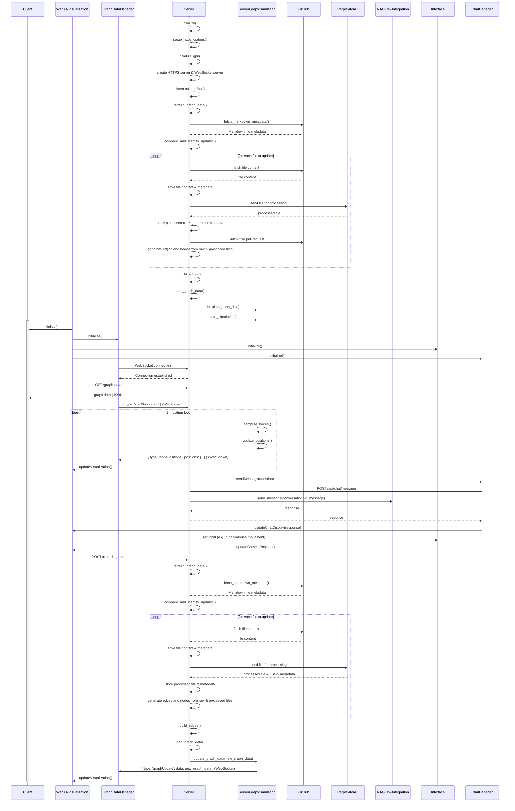
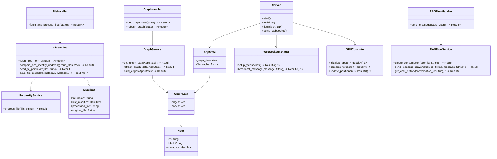
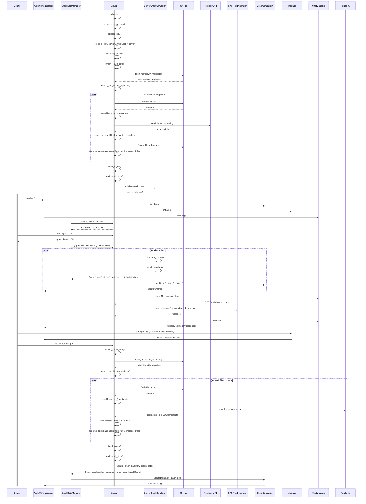

# WebXR Graph Visualization of Logseq Knowledge Graphs with RAGFlow Integration


## Project Overview

This application transforms a LogSeq personal knowledge base into an interactive 3D graph, viewable in mixed reality environments. It automatically parses Markdown files from a privately hosted GitHub repository, processes them via the Perplexity AI API to enhance content, and integrates with RAGFlow for AI-powered question answering. Changes are submitted back to the source repository as pull requests (PRs). The system builds its own edge linkages between connected nodes based on bidirectional references, generating both processed and raw JSON metadata for comparison. This rich metadata, combined with citation and web link data, is visualised using a force-directed 3D graph with WebXR and Three.js. The visual graph can be interactively explored across desktop and immersive AR devices, with real-time updates facilitated by WebSockets.

**Key features include:**

- **3D Visualisation** of knowledge graph nodes and edges with real-time updates
- **WebXR Compatibility** for immersive exploration on AR and VR devices
- **Efficient WebSocket Communication** for dynamic node position updates
- **GPU Acceleration** on both server and client sides for enhanced performance
- **Node Labels as Billboards** for clear and interactive node identification
- **Integration with RAGFlow** for AI-powered question answering within the graph interface
- **Spacemouse Support** for intuitive navigation in immersive environments
- **Automatic GitHub PR Submissions** for processed content updates
- **Comprehensive Metadata Management** for both processed and raw files

## Architecture

The project comprises a Rust-based server running in a Docker container and a JavaScript client-side application. The architecture has been enhanced to support GPU acceleration, efficient real-time updates, and immersive AR experiences.

### New Class Diagram


### New Sequence Diagram



### Old Class Diagram



### Old Sequence Diagram



## File Structure

### Server-Side (Rust)

- **src/**
  - `main.rs`: Entry point for the Rust server
  - `app_state.rs`: Shared application state
  - `handlers/`
    - `graph_handler.rs`: Handles graph data requests
    - `file_handler.rs`: Manages file operations and GitHub interactions
    - `ragflow_handler.rs`: Handles RAGFlow API interactions
  - `services/`
    - `graph_service.rs`: Core graph processing and management
    - `file_service.rs`: File handling and Perplexity integration
    - `ragflow_service.rs`: RAGFlow conversation management
    - `perplexity_service.rs`: Interaction with Perplexity API
  - `models/`
    - `graph.rs`: Graph data structures
    - `metadata.rs`: File metadata representation
    - `node.rs`: Graph node structure
  - `utils/`
    - `websocket_manager.rs`: Server-side WebSocket management
    - `gpu_compute.rs`: GPU acceleration for server-side computations using WebGPU

### Client-Side (JavaScript)

- **public/js/**
  - `index.html`: Main HTML file served by the Rust server
  - `app.js`: Main application setup and initialization

- **public/js/components/**
  - `webXRVisualization.js`: Manages WebXR rendering and interactions with GPU acceleration
  - `interface.js`: Manages UI elements like error messages and node information panels
  - `chatManager.js`: Manages chat interface and RAGFlow interactions

- **public/js/services/**
  - `websocketService.js`: Client-side WebSocket handling with automatic reconnection
  - `graphDataManager.js`: Manages graph data and WebSocket communication
  - `ragflowService.js`: Manages interactions with RAGFlow API via WebSocket

- **public/js/threeJS/**
  - `threeSetup.js`: Three.js scene initialization and utility functions
  - `threeGraph.js`: Three.js graph rendering and updates

- **public/js/xr/**
  - `xrSetup.js`: WebXR session setup and management
  - `xrInteraction.js`: XR-specific interaction handling, including controller events and label billboards

- **public/js/**
  - `gpuUtils.js`: Optional GPU acceleration utilities for client-side computations

### Tests

Unit and integration tests are provided for all major components, both on the server and client sides, under the `tests` directory.

## Installation and Setup

### Prerequisites

- **Docker** with NVIDIA GPU support
- **Rust** (for local development)
- **Node.js** and **npm** (for local development)
- **GitHub Personal Access Token**
- **RAGFlow API Key**
- **Perplexity API Key**
- **GPU-enabled server** for mandatory server-side acceleration
- **GPU-enabled client device** for enhanced performance (optional)

### Environment Setup

1. **Clone the repository:**

   ```bash
   git clone https://github.com/yourusername/webxr-graph.git
   cd webxr-graph
   ```

2. **Create a `.env` file in the root directory:**

   ```
   GITHUB_ACCESS_TOKEN=your_token_here
   GITHUB_OWNER=your_github_username
   GITHUB_REPO=your_repo_name
   GITHUB_DIRECTORY=path/to/markdown/files
   RAGFLOW_API_KEY=your_ragflow_api_key_here
   RAGFLOW_BASE_URL=http://your_ragflow_base_url/v1/
   PERPLEXITY_API=http://your_perplexity_url/
   ```

### Running with Docker

1. **Build and run the Docker container:**

   ```bash
   docker-compose up --build
   ```

2. **Access the application:**

   Open your WebXR-compatible browser and navigate to `https://localhost:8443`.

### Local Development

1. **Install Rust dependencies:**

   ```bash
   cargo build
   ```

2. **Install JavaScript dependencies:**

   ```bash
   npm install
   ```

3. **Run the Rust server:**

   ```bash
   cargo run
   ```

4. **Serve the frontend:**

   You may need to set up a separate web server or use a development server like `live-server`:

   ```bash
   npx live-server public
   ```

## Network Considerations

To optimize network efficiency when updating node positions in a force-directed graph over WebSocket, especially for scaling with a large number of nodes and frequent updates, consider the following strategies:

1. **Use Delta Updates (Differences):**

   - **Description:** Instead of sending absolute positions of each node on every update, send only the delta (change) in position.
   - **Implementation:** Calculate the change `(delta_x, delta_y, delta_z)` for each node and send those values. The client updates the node position incrementally.
   - **Pros:**
     - Reduces bandwidth usage significantly for small, frequent updates.
     - Scales well with more nodes, as fewer bytes per node are transmitted.
   - **Cons:**
     - Requires reliable order of messages, though WebSockets generally ensure message ordering.

   ```json
   {
     "node_id": "A",
     "delta": [0.1, -0.2, 0.05]
   }
   ```

2. **Quaternions for Rotation:**

   - **Description:** Use quaternions for orientation updates instead of Euler angles or rotation matrices.
   - **Implementation:** Send quaternion arrays `[x, y, z, w]` to represent rotations.
   - **Pros:**
     - More compact and efficient than Euler angles.
     - Avoids gimbal lock.
   - **Cons:**
     - Requires client-side handling, which is supported by Three.js.

   ```json
   {
     "node_id": "A",
     "quat": [0.707, 0, 0, 0.707]
   }
   ```

3. **Sparse Updates (Only Update Moving Nodes):**

   - **Description:** Send updates only for nodes that have moved beyond a certain threshold.
   - **Implementation:** Track each node’s last known position and send updates only if the difference exceeds the threshold.
   - **Pros:**
     - Prevents unnecessary data transmission.
     - Ideal for graphs where only portions change frequently.
   - **Cons:**
     - Slight latency for nodes moving slowly but steadily.

   ```json
   [
     {
       "node_id": "A",
       "delta": [0.05, -0.03, 0.01]
     },
     {
       "node_id": "B",
       "delta": [0.2, 0.1, 0]
     }
   ]
   ```

4. **Compression of Updates:**

   - **Description:** Apply lightweight compression (e.g., gzip or Brotli) to WebSocket messages.
   - **Implementation:** Utilize WebSocket's built-in compression features.
   - **Pros:**
     - Significant bandwidth reduction for large graphs.
   - **Cons:**
     - Minimal CPU overhead on both server and client.
     - Requires proper configuration of WebSocket libraries.

5. **Batch Updates:**

   - **Description:** Group several node updates into a single WebSocket message.
   - **Implementation:** Accumulate updates over a short period (e.g., 50ms) and send them as a batch.
   - **Pros:**
     - Reduces WebSocket message overhead.
     - More efficient for large-scale graphs.
   - **Cons:**
     - Introduces slight delays between updates, though minimal.

   ```json
   {
     "batch": [
       {
         "node_id": "A",
         "delta": [0.1, 0.05, -0.1]
       },
       {
         "node_id": "B",
         "delta": [0, 0.03, 0.2]
       }
     ]
   }
   ```

6. **Client-Side Interpolation:**

   - **Description:** Use client-side interpolation to smooth out position transitions between updates.
   - **Implementation:** Send target positions and velocities, allowing the client to interpolate.
   - **Pros:**
     - Reduces the frequency of updates.
     - Provides smoother animations.
   - **Cons:**
     - Requires more client-side computation.

   ```json
   {
     "node_id": "A",
     "target_position": [1.0, 2.0, 1.5],
     "velocity": [0.1, -0.2, 0.05]
   }
   ```

**Summary of Strategies:**

- **Delta Updates:** Minimize data size by sending only position changes.
- **Quaternions for Rotation:** Efficiently handle node orientation.
- **Sparse Updates:** Update only significantly moved nodes.
- **Compression:** Reduce bandwidth usage with WebSocket compression.
- **Batch Updates:** Group updates to minimize message overhead.
- **Client-Side Interpolation:** Smooth animations with fewer updates.

By combining these strategies, the application ensures efficient network usage, scalability, and a smooth user experience even as the graph scales in size.

## Running Tests

### Rust Tests

- **Unit Tests:**

  ```bash
  cargo test
  ```

- **Integration Tests:**

  Located in `tests/server/integration_tests.rs`

  ```bash
  cargo test --test integration_tests
  ```

### JavaScript Tests

- **Unit and Integration Tests:**

  ```bash
  npm test
  ```

- **Test Coverage:**

  Generate coverage reports using:

  ```bash
  npm run test -- --coverage
  ```

**Test Coverage Details:**

- **Server-Side Tests (Rust):**
  - **Unit Tests:** Located in `tests/server/` directory
    - `app_state_test.rs`: Tests for AppState functionality
    - `metadata_test.rs`: Tests for Metadata struct and its methods
    - `file_handler_test.rs`: Tests for file handling operations
    - `graph_service_test.rs`: Tests for graph processing and management
    - `ragflow_service_test.rs`: Tests for RAGFlow service operations
  - **Integration Tests:** Located in `tests/server/integration_tests.rs`
    - End-to-end workflow tests
    - Graph update workflow tests

- **Client-Side Tests (JavaScript):**
  - Located in `tests/client/` directory
    - `interface.test.js`: Tests for user interface components
    - `graphService.test.js`: Tests for client-side graph data management
    - `websocketService.test.js`: Tests for WebSocket communication
    - ... (additional client-side test files)

Our test suite adheres to best practices for Test-Driven Development (TDD), ensuring robust and reliable application behaviour through comprehensive coverage of both success and error scenarios.

## Development Status

The project is under active development with recent and ongoing enhancements:

**Recent Improvements:**

- **Enhanced Test Coverage:** Comprehensive tests for both server and client components, ensuring reliability and facilitating future development.
- **Integration Tests:** Established end-to-end workflow tests to validate the complete application flow.
- **Mocking Enhancements:** Improved mocking for API interactions within `PerplexityService` and `RAGFlowService`.

**Ongoing Focus Areas:**

- **Optimising WebGPU Integration:** Enhancing server-side graph computations for better performance using WebGPU.
- **Finalising Perplexity Integration:** Ensuring seamless processing and enhancement of Markdown files via the Perplexity AI API.
- **Expanding Unit Tests:** Continuously improving test coverage to encompass all new features and components.
- **Performance Enhancements:** Further optimising the Rust-based server for scalability and efficiency.

## Contributing

Contributions are welcome! Please follow these steps to contribute:

1. **Fork the Repository:** Click the "Fork" button at the top right of this page to create your own fork.
2. **Clone Your Fork:**

   ```bash
   git clone https://github.com/yourusername/webxr-graph.git
   cd webxr-graph
   ```

3. **Create a New Branch:**

   ```bash
   git checkout -b feature/your-feature-name
   ```

4. **Make Your Changes:** Implement your feature or fix.
5. **Commit Your Changes:**

   ```bash
   git commit -m "Add feature: your feature description"
   ```

6. **Push to Your Fork:**

   ```bash
   git push origin feature/your-feature-name
   ```

7. **Create a Pull Request:** Navigate to your fork on GitHub and click the "Compare & pull request" button.

Please ensure that your contributions adhere to the project's coding standards and include relevant tests where applicable.

## License

This project is licensed under the [Creative Commons CC0 license](LICENSE).

---
