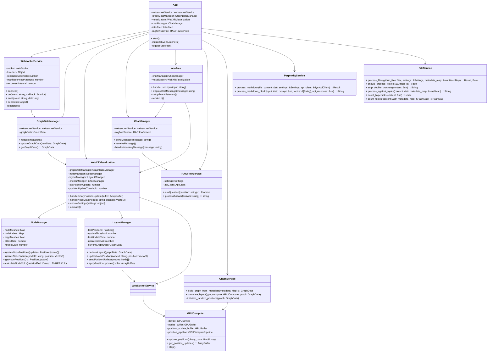
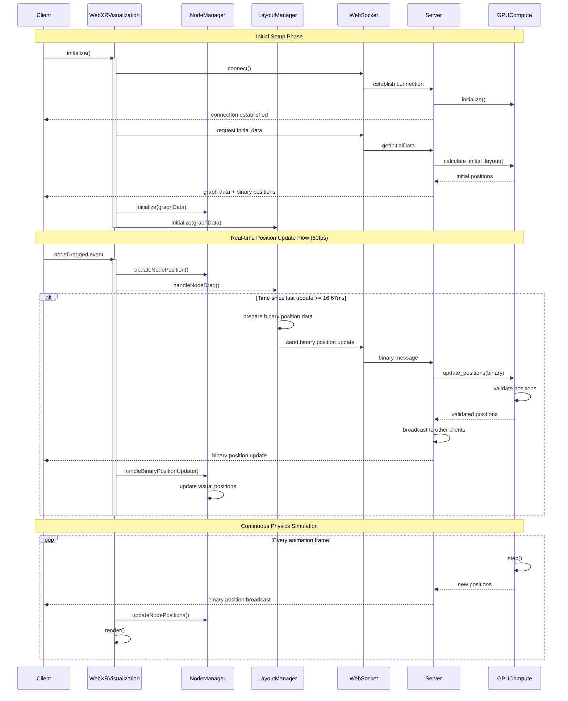

# WebXR Graph Visualization of Logseq Knowledge Graphs with RAGFlow Integration


Inspired by Prof Rob Aspin's work 
https://github.com/trebornipsa


## Project Overview

The **WebXR Graph Visualization** project transforms a Logseq personal knowledge base into an interactive 3D graph, accessible in mixed-reality environments. The system automates the parsing of Markdown files from a privately hosted GitHub repository, enhances the content using the **Perplexity AI API**, and integrates with **RAGFlow** for AI-powered question answering. Processed changes are submitted back to the source repository as pull requests (PRs).

**Key Features:**

Inspired by Prof Rob Aspin's work 
https://github.com/trebornipsa

Integrates Sonata Rust wrapper for Piper
https://github.com/mush42/sonata


- **3D Visualization:** Dynamic representation of knowledge graph nodes and edges with real-time updates.
- **WebXR Compatibility:** Immersive exploration on Augmented Reality (AR) and Virtual Reality (VR) devices.
- **Efficient WebSocket Communication:** Facilitates dynamic node position updates and real-time interactions.
- **GPU Acceleration:** Enhances performance on both server and client sides using WebGPU.
- **Node Labels as Billboards:** Clear and interactive identification of nodes within the graph.
- **Integration with RAGFlow:** Enables AI-powered question answering directly within the graph interface.
- **Spacemouse Support:** Offers intuitive navigation within immersive environments.
- **Automatic GitHub PR Submissions:** Streamlines the process of updating processed content back to GitHub.
- **Comprehensive Metadata Management:** Handles both processed and raw JSON metadata for enhanced data representation.
- **OpenAI Integration:** Provides text-to-speech capabilities for enhanced accessibility.

## Architecture

The project comprises a **Rust-based server** running within a Docker container and a **JavaScript client-side application**. The architecture emphasizes GPU acceleration, efficient real-time updates, and immersive AR experiences.

### Class Diagram



### Sequence Diagram



## Installation

### Prerequisites

Ensure that the following dependencies are installed on your system:

- **Rust** (version 1.70 or later)
- **Node.js** (version 14 or later)
- **Docker** (for containerization)
- **Git** (for version control)

### Setup

1. **Clone the Repository:**

    ```bash
    git clone https://github.com/yourusername/webxr-graph.git
    cd webxr-graph
    ```

2. **Configure Environment Variables:**

    Create a `.env` file in the root directory and populate it with your API keys and configurations.

    ```env
    PERPLEXITY_API_KEY=your_perplexity_api_key
    GITHUB_ACCESS_TOKEN=your_github_token
    RAGFLOW_API_KEY=your_ragflow_api_key
    RAGFLOW_API_BASE_URL=your_ragflow_base_url
    OPENAI_API_KEY=your_openai_api_key
    OPENAI_BASE_URL=https://api.openai.com/v1
    TUNNEL_TOKEN=your_cloudflare_tunnel_token
    DOMAIN=your_domain_name
    ```

    **Note:** Ensure that sensitive information like API keys is **never** hardcoded and is managed securely.

3. **Update Configuration File:**

    Ensure that `settings.toml` is correctly configured with the necessary fields. Refer to the Settings Configuration section for details.

4. **Build the Rust Server:**

    ```bash
    cargo build --release
    ```

5. **Run the Server Locally:**

    ```bash
    cargo run --release
    ```

6. **Start the Client Application:**

    Navigate to the client directory and install dependencies.

    ```bash
    cd client
    npm install
    npm start
    ```

7. **Building and Running with Docker:**

    Ensure Docker is installed and running on your system.

    ```bash
    ./launch-docker.sh
    ```

### Security Verification

1. **Container Security Checklist:**
   - [ ] Containers running as non-root
   - [ ] Read-only filesystem enabled
   - [ ] Network properly isolated
   - [ ] Resource limits enforced
   - [ ] Health checks passing
   - [ ] Proper logging configured
   - [ ] Secure volume mounts
   - [ ] Cloudflare tunnel active

2. **File Permissions:**
```bash
# Verify directory permissions
ls -la /app/data

# Check configuration files
ls -la /etc/logseq-security/

# Verify log permissions
ls -la /var/log/logseq-security/
```

3. **Network Security:**
```bash
# Check network isolation
docker network inspect logseq-net

# Verify exposed ports
docker port logseqXR
```

### Security Maintenance

1. **Regular Updates:**
```bash
# Update security components
./setup-security.sh --update

# Rebuild with latest security patches
docker compose build --no-cache
```

2. **Monitoring:**
```bash
# View security logs
journalctl -u security-monitor

# Check container health
docker compose ps

# Monitor resource usage
docker stats --format "table {{.Name}}\t{{.CPUPerc}}\t{{.MemUsage}}\t{{.NetIO}}"
```

[Rest of the README remains unchanged...]
