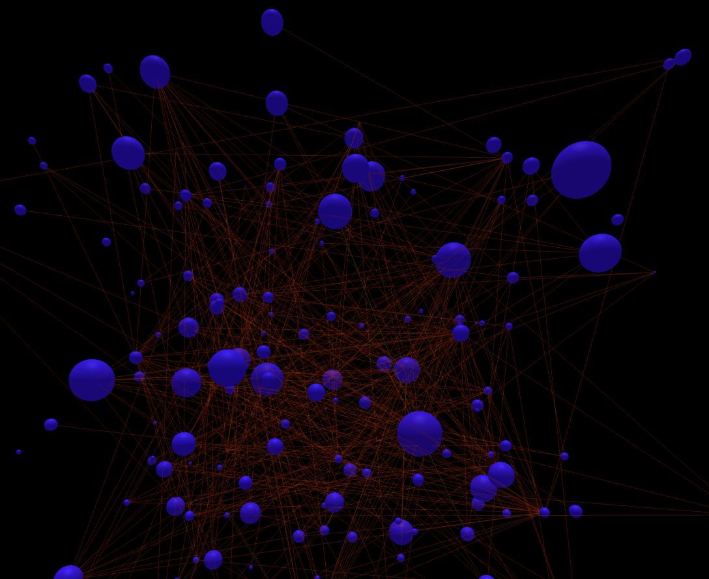
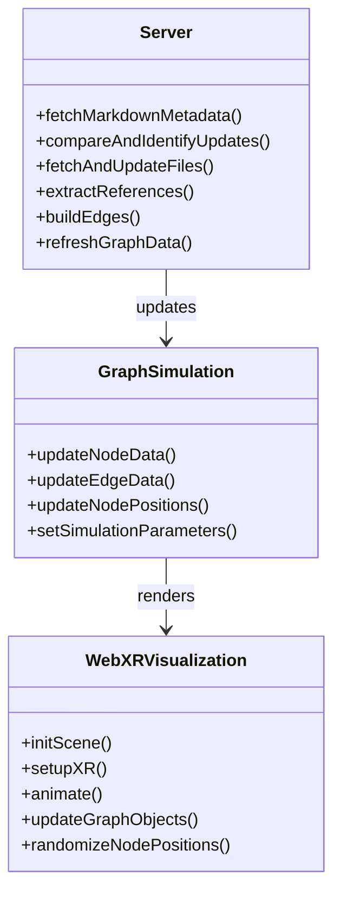
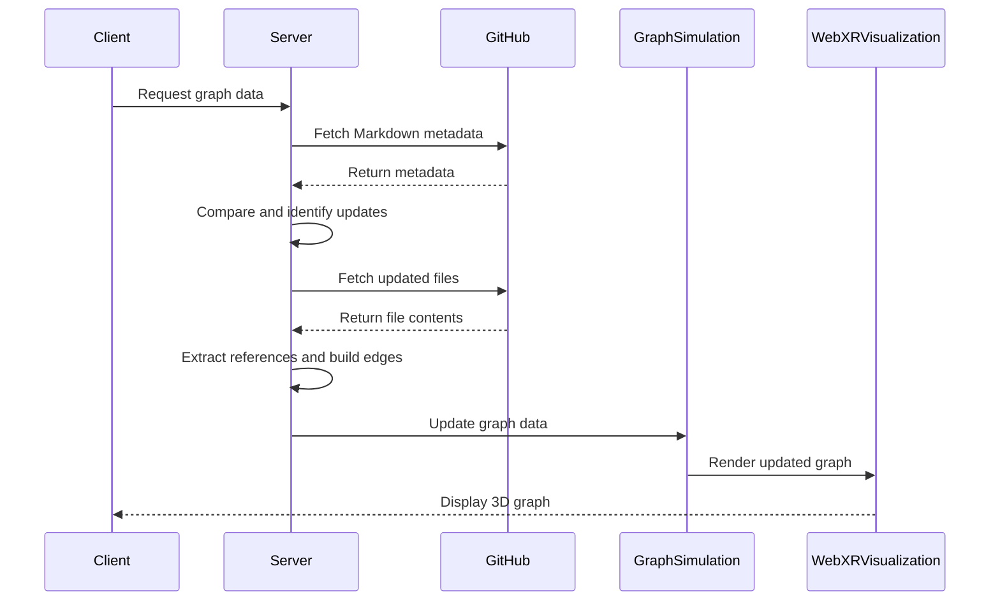

# WebXR Graph Visualization

This project visualizes GitHub Markdown files as a 3D graph using WebXR. It fetches Markdown files from a specified GitHub repository, parses them to create nodes and edges, and then uses Three.js to render this graph in an immersive 3D space.



## Features

- Fetch and parse Markdown files from GitHub
- Generate nodes and edges based on Markdown content
- Render a 3D graph using WebXR and Three.js
- HTTPS setup with self-signed certificate
- Efficiently checks for file changes before downloading
- Randomize node positions with spacebar
- Color nodes based on hyperlink count

## Getting Started

### Prerequisites

- Docker
- Node.js
- GitHub Personal Access Token

### Setup

1. **Clone the Repository:**

   ```bash
   git clone https://github.com/yourusername/webxr-graph.git
   cd webxr-graph
Set up Environment Variables: Create a .env file in the root directory and add your GitHub access token:

GITHUB_ACCESS_TOKEN=your_token_here
GITHUB_OWNER=your_github_username
GITHUB_REPO=your_repo_name
GITHUB_DIRECTORY=path/to/markdown/files
Build and Run with Docker:

./start_docker.sh
This script builds the Docker image and runs the container, mapping port 8443 and mounting the processed_files directory.

Access the Application: Open a WebXR-compatible browser and navigate to https://localhost:8443

## Architecture
Class Diagram

Sequence Diagram

# Key Components
server.js: Handles server-side operations, including GitHub API interactions and graph data processing.
script.js: Manages client-side WebXR visualization and user interactions.
## GraphSimulation: Handles the physics simulation for node positioning.
Usage
Use a WebXR-compatible browser to view the 3D graph.
Press the spacebar to randomize node positions.
Nodes are colored based on their hyperlink count, ranging from blue (low) to red (high).

# TODO

## Features and Interactions

1. **Hand Interaction (VR/AR)**:
    - Implement hand tracking to allow users to grab and manipulate nodes in 3D space. 
    - Use pinch gestures to select nodes and make dragging intuitive.
    - Leverage hand models to show real-time interactions, enhancing immersion.

2. **Mouse Click and Drag (Desktop/Mobile)**:
    - Enable users to click and drag nodes using a mouse for desktop browsers.
    - Implement kinetic dragging, where nodes continue to move slightly after releasing them to simulate inertia.

3. **Pass-Through AR (Meta Quest 3)**:
    - Integrate pass-through AR to allow users to see their real-world environment while interacting with the graph.
    - Use spatial anchors to place nodes at fixed points in the user's environment, making the experience more tangible.

4. **Navigation Keys Improvement**:
    - Redefine navigation keys for ease of use and accessibility.
    - Allow customization of key bindings for user preferences.
    - Include smooth panning and zooming capabilities with keyboard shortcuts.

5. **Interactive Node Summaries**:
    - Allow users to double-click or shake a node to view a summary of the Markdown content.
    - Display the summary in a floating, draggable window within the 3D space.
    - Highlight and focus on the selected node, fading out non-related nodes to minimize clutter.

6. **Search and Filter Functionality**:
    - Integrate a search bar where users can type keywords to find and highlight specific nodes.
    - Implement filters to show or hide nodes based on tags or content type.

7. **Tags and Color Coding**:
    - Use tags to categorize nodes and color-code them for visual distinction.
    - Allow users to customize tag categories and corresponding colors.

8. **Audio Feedback and Narration**:
    - Add audio feedback for interactions (e.g., a subtle sound when grabbing or moving a node).
    - Implement text-to-speech for node summaries, where users can listen to the Markdown content instead of reading it.

9. **Collaborative Mode**:
    - Develop a multi-user mode where multiple users can interact with the same graph in real-time.
    - Allow users to see each other's hand movements and interactions (e.g., different colored hand representations).

10. **Heatmap Visualization**:
    - Implement heatmap functionalities to show the most interacted-with nodes.
    - Help users identify critical information quickly by visualizing interaction density.

11. **Bookmarking and Annotations**:
    - Allow users to bookmark nodes and add annotations to them.
    - Provide a side panel where users can view and edit their bookmarks and notes.

12. **Advanced Physics Simulation**:
   - Enhance node movements with more sophisticated physics, such as elastic and magnetic effects, to make the interactions feel more lifelike.
   - Adjust simulation parameters dynamically based on the size and complexity of the graph.


## Contributing
Contributions are welcome! Please feel free to submit a Pull Request.

## License
This project is licensed under the Creative Commons CC0 license.

