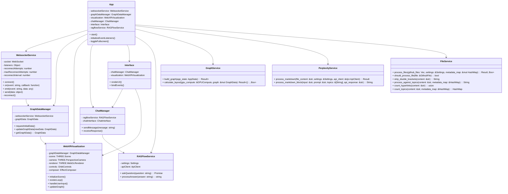
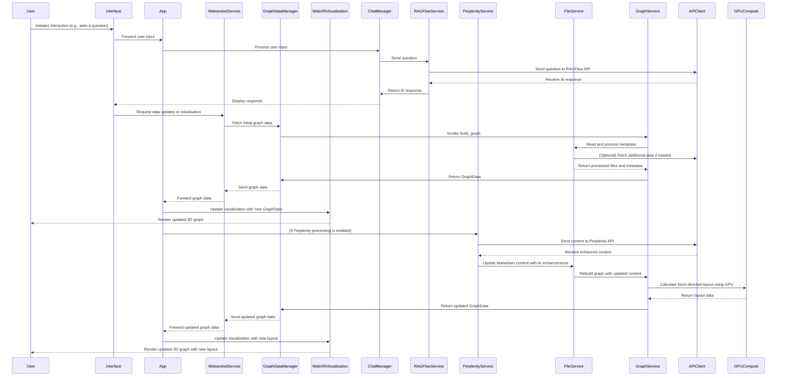

# WebXR Graph Visualisation of Logseq Knowledge Graphs with RAGFlow Integration


## Project Overview

This application transforms a LogSeq personal knowledge base into an interactive 3D graph, viewable in mixed reality environments. It automatically parses Markdown files from a privately hosted GitHub repository, processes them via the Perplexity AI API to enhance content, and integrates with RAGFlow for AI-powered question answering. Changes are submitted back to the source repository as pull requests (PRs). The system builds its own edge linkages between connected nodes based on bidirectional references, generating both processed and raw JSON metadata for comparison. This rich metadata, combined with citation and web link data, is visualised using a force-directed 3D graph with WebXR and Three.js. The visual graph can be interactively explored across desktop and immersive AR devices, with real-time updates facilitated by WebSockets.

**Key features include:**

- **3D Visualisation** of knowledge graph nodes and edges with real-time updates
- **WebXR Compatibility** for immersive exploration on AR and VR devices
- **Efficient WebSocket Communication** for dynamic node position updates
- **GPU Acceleration** on both server and client sides for enhanced performance
- **Node Labels as Billboards** for clear and interactive node identification
- **Integration with RAGFlow** for AI-powered question answering within the graph interface
- **Spacemouse Support** for intuitive navigation in immersive environments
- **Automatic GitHub PR Submissions** for processed content updates
- **Comprehensive Metadata Management** for both processed and raw files

## Architecture

The project comprises a Rust-based server running in a Docker container and a JavaScript client-side application. The architecture supports GPU acceleration, efficient real-time updates, and immersive AR experiences.

### Class Diagram



### Sequence Diagram



## Installation

### Prerequisites

- **Rust** (version 1.70 or later)
- **Node.js** (version 14 or later)
- **Docker** (for containerisation)
- **Git** (for version control)

### Setup

1. **Clone the Repository:**

    ```bash
    git clone https://github.com/yourusername/webxr-graph.git
    cd webxr-graph
    ```

2. **Configure Environment Variables:**

    Create a `.env` file in the root directory and populate it with your API keys and configurations.

    ```env
    PERPLEXITY_API_KEY=your_perplexity_api_key
    GITHUB_ACCESS_TOKEN=your_github_token
    RAGFLOW_API_KEY=your_ragflow_api_key
    RAGFLOW_API_BASE_URL=your_ragflow_base_url
    OPENAI_API_KEY=your_openai_api_key
    ```

3. **Update Configuration File:**

    Ensure that `settings.toml` is correctly configured with the necessary fields. Refer to the [Settings Configuration](#settings-configuration) section for details.

4. **Build the Rust Server:**

    ```bash
    cargo build --release
    ```

5. **Run the Server Locally:**

    ```bash
    cargo run --release
    ```

6. **Start the Client Application:**

    Navigate to the client directory and install dependencies.

    ```bash
    cd client
    npm install
    npm start
    ```

7. **Building and Running with Docker:**

    Ensure Docker is installed and running.

    ```bash
    ./launch-docker.sh
    ```

## Settings Configuration

The application relies on a `settings.toml` file for configuration. Below is an example configuration with explanations for each section.

```toml
# settings.toml

# Prompt for the AI assistant
prompt = """
You are an AI assistant building summaries of web links and text. You will visit any web links found in the text and integrate
a summary with web citations, aiming for up to two citations explicitly returned in context as raw web hyperlinks.
Ensure to return web links as citations separated by new lines.
You should aim to select one or more of these topics in this form appropriate to the created summary,
embedding the topic in Logseq double square brackets once in the returned text.
"""

# List of topics to embed in the summary
topics = [
    "Artificial Intelligence",
    "Machine Learning",
    "Rust Programming",
    "Web Development",
    "WebXR",
    "Three.js",
    "GPU Computing",
    "Graph Visualization",
    "Markdown Processing"
]

[perplexity]
perplexity_api_key = "your_perplexity_api_key"
perplexity_model = "llama-3.1-sonar-small-128k-online"
perplexity_api_base_url = "https://api.perplexity.ai/chat/completions"
perplexity_max_tokens = 4096
perplexity_temperature = 0.7
perplexity_top_p = 1.0
perplexity_presence_penalty = 0.0
perplexity_frequency_penalty = 0.0

[github]
github_access_token = "your_github_token"
github_owner = "your_github_owner"
github_repo = "your_github_repo"
github_directory = "your_github_directory"

[ragflow]
ragflow_api_key = "your_ragflow_api_key"
ragflow_api_base_url = "your_ragflow_base_url"

[openai]
api_key = "your_openai_api_key"
base_url = "https://api.openai.com/v1"

# Default configurations (can be overridden by environment variables)
[default]
max_concurrent_requests = 5
max_retries = 3
retry_delay = 5
api_client_timeout = 30

[visualization]
node_color = "0x1A0B31"
edge_color = "0xff0000"
hologram_color = "0xFFD700"
node_size_scaling_factor = 1000
hologram_scale = 5
hologram_opacity = 0.1
edge_opacity = 0.3
label_font_size = 36
fog_density = 0.002
```

### Explanation of Configuration Sections

- **Prompt Section:**
  - Defines the system prompt for the AI assistant, guiding its behaviour in summarising content and embedding topics.

- **Topics:**
  - A list of topics that the AI assistant should focus on when generating summaries.

- **Perplexity:**
  - **perplexity_api_key:** Your API key for the Perplexity AI service.
  - **perplexity_model:** The model used by Perplexity for processing.
  - **perplexity_api_base_url:** The base URL for the Perplexity API.
  - **perplexity_max_tokens:** Maximum number of tokens to generate.
  - **perplexity_temperature, perplexity_top_p, perplexity_presence_penalty, perplexity_frequency_penalty:** Parameters controlling the randomness and creativity of the AI's responses.

- **GitHub:**
  - **github_access_token:** Your GitHub access token for repository interactions.
  - **github_owner:** Owner of the GitHub repository.
  - **github_repo:** Name of the GitHub repository.
  - **github_directory:** Directory within the repository to monitor and update.

- **RAGFlow:**
  - **ragflow_api_key:** API key for RAGFlow integration.
  - **ragflow_api_base_url:** Base URL for the RAGFlow API.

- **OpenAI:**
  - **api_key:** Your OpenAI API key for accessing OpenAI services.
  - **base_url:** Base URL for the OpenAI API.

- **Default:**
  - **max_concurrent_requests:** Maximum number of concurrent API requests.
  - **max_retries:** Number of retry attempts for failed requests.
  - **retry_delay:** Delay between retry attempts in seconds.
  - **api_client_timeout:** Timeout for API client requests in seconds.

- **Visualization:**
  - **node_color, edge_color, hologram_color:** Colour codes for nodes, edges, and holograms in the visualization.
  - **node_size_scaling_factor:** Scaling factor for node sizes.
  - **hologram_scale:** Scale factor for hologram visuals.
  - **hologram_opacity, edge_opacity:** Opacity levels for holograms and edges.
  - **label_font_size:** Font size for node labels.
  - **fog_density:** Density of fog effects in the visualization.

## Development Status

The project is under active development with recent and ongoing enhancements:

**Recent Improvements:**

- **Enhanced Test Coverage:** Comprehensive tests for both server and client components, ensuring reliability and facilitating future development.
- **Integration Tests:** Established end-to-end workflow tests to validate the complete application flow.
- **Mocking Enhancements:** Improved mocking for API interactions within `PerplexityService` and `RAGFlowService`.
- **GPU Compute Integration:** Successfully integrated GPUCompute for accelerated graph layout calculations using WebGPU.

**Ongoing Focus Areas:**

- **Optimising WebGPU Integration:** Enhancing server-side graph computations for better performance using WebGPU.
- **Finalising Perplexity Integration:** Ensuring seamless processing and enhancement of Markdown files via the Perplexity AI API.
- **Expanding Unit Tests:** Continuously improving test coverage to encompass all new features and components.
- **Performance Enhancements:** Further optimising the Rust-based server for scalability and efficiency.
- **RAGFlow Integration Refinement:** Enhancing the integration with RAGFlow for more robust AI-powered question answering capabilities.

## Testing

Our test suite adheres to best practices for Test-Driven Development (TDD), ensuring robust and reliable application behaviour through comprehensive coverage of both success and error scenarios.

### Server-Side Tests (Rust)

Located in the `tests/server/` directory:

- `graph_service_test.rs`: Tests for graph building and management.
- `ragflow_service_test.rs`: Tests for RAGFlow integration.
- `perplexity_service_test.rs`: Tests for Perplexity API interactions.
- `file_service_test.rs`: Tests for GitHub file processing.

### Client-Side Tests (JavaScript)

Located in the `tests/client/` directory:

- `interface.test.js`: Tests for user interface components.
- `graphService.test.js`: Tests for client-side graph data management.
- `websocketService.test.js`: Tests for WebSocket communication.
- ... (additional client-side test files)

## Usage

### Running Locally

1. **Start the Rust Server:**

    ```bash
    cargo run --release
    ```

2. **Start the Client Application:**

    ```bash
    cd client
    npm install
    npm start
    ```

3. **Access the Application:**

    Navigate to `http://localhost:3000` in your web browser to interact with the 3D knowledge graph.

### Using Docker

1. **Build the Docker Image:**

    ```bash
    docker build -t webxr-graph-image .
    ```

2. **Run the Docker Container:**

    ```bash
    docker run -d \
      -p 8080:8080 \
      -e OPENAI_API_KEY=your_openai_api_key \
      webxr-graph-image
    ```

    **Note:** Ensure that sensitive information like API keys are managed securely and not hardcoded within Docker images.

## Contributing

Contributions are welcome! Please follow these steps to contribute:

1. **Fork the Repository:** Click the "Fork" button at the top right of this page to create your own fork.
2. **Clone Your Fork:**

    ```bash
    git clone https://github.com/yourusername/webxr-graph.git
    cd webxr-graph
    ```

3. **Create a New Branch:**

    ```bash
    git checkout -b feature/your-feature-name
    ```

4. **Make Your Changes:** Implement your feature or fix.
5. **Commit Your Changes:**

    ```bash
    git commit -m "Add feature: your feature description"
    ```

6. **Push to Your Fork:**

    ```bash
    git push origin feature/your-feature-name
    ```

7. **Create a Pull Request:** Navigate to your fork on GitHub and click the "Compare & pull request" button.

Please ensure that your contributions adhere to the project's coding standards and include relevant tests where applicable.

## License

This project is licensed under the [Creative Commons CC0 license](LICENSE).

## Acknowledgements

- **Perplexity AI:** For providing robust AI capabilities for content enhancement.
- **RAGFlow:** For enabling AI-powered question answering within the application.
- **LogSeq:** For facilitating powerful knowledge management through Markdown files.
- **Three.js & WebXR:** For enabling immersive 3D visualisations and mixed reality experiences.
- **Rust Community:** For creating a performant and reliable language ecosystem.
- **Docker:** For simplifying containerisation and deployment processes.

## Contact

For any questions or support, please open an issue on the [GitHub repository](https://github.com/yourusername/webxr-graph/issues) or contact the maintainer at [youremail@example.com](mailto:youremail@example.com).

---
```
