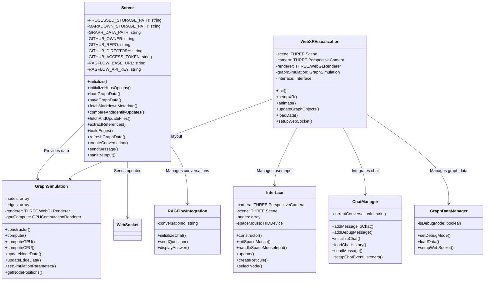
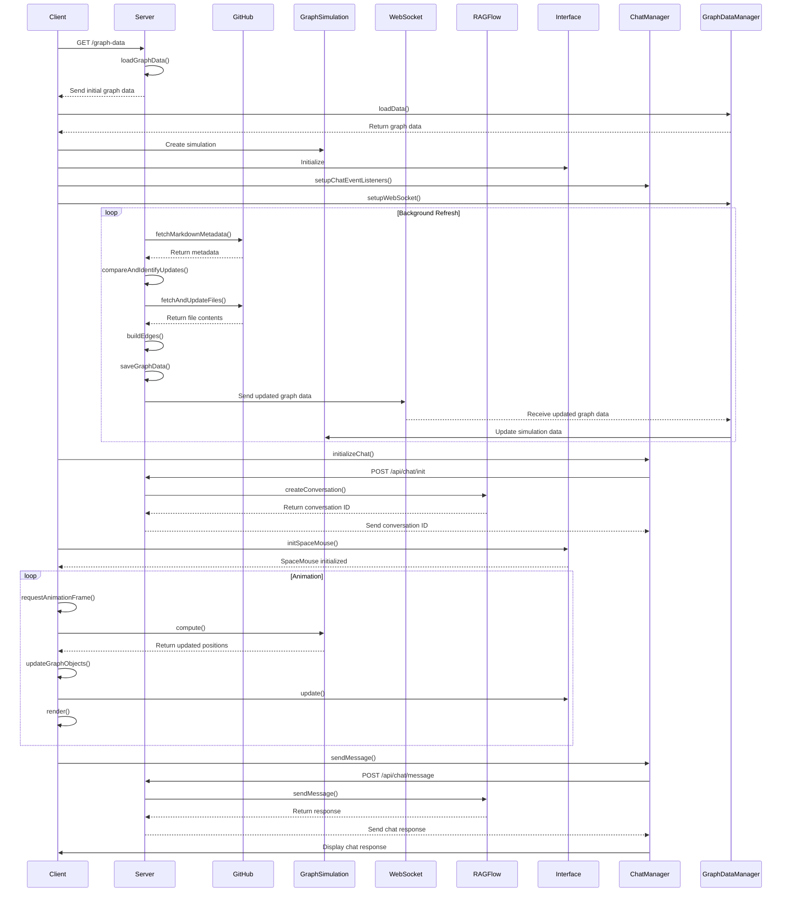

# WebXR Graph Visualization of Logseq Knowledge Graphs with RAGFlow Integration

This project visualizes privately hosted GitHub Markdown files created by LogSeq and integrates with RAGFlow for question answering capabilities.

This is my LogSeq personal knowledge base, which is about 10 months old. I am NOT a programmer, this was an AI project with Claude in the main, using Continue extension in VSCode. There will be issues, I have no doubt, but it's working out so far.


When I commit changes to the graph into a private GitHub repo it's automatically parsed for public pages and pushed to a website
https://narrativegoldmine.com/#/graph

The 2D graph seen there is fine, but a bit useless. I wanted something I can explore in mixed reality, and this project is the start of that. It pulls from the public labelled elements of the repo and creates a force-directed 3D graph using WebXR. It uses Three.js to render this graph in an immersive 3D space.


## Features

- Fetch and parse Markdown files from GitHub
- Generate nodes and edges based on Markdown content
- Render a 3D graph using WebXR and Three.js
- HTTPS setup with self-signed certificate
- Efficiently checks for file changes before downloading
- Randomize node positions with spacebar
- Color nodes based on hyperlink count
- GPU-accelerated force-directed graph layout with CPU fallback
- Dynamic node labeling for closer nodes
- Real-time updates via WebSocket
- Responsive design (handles window resizing)
- Debug overlay with node and edge counts and simulation type (CPU/GPU)
- Integration with RAGFlow for question answering capabilities

## Getting Started

### Prerequisites

- Docker
- Node.js
- GitHub Personal Access Token
- RAGFlow API Key

### Setup

1. **Clone the Repository:**
   ```bash
   git clone https://github.com/yourusername/webxr-graph.git
   cd webxr-graph
   ```

2. **Set up Environment Variables:** 
   Create a `.env` file in the root directory and add your GitHub access token and RAGFlow API key:
   ```
   GITHUB_ACCESS_TOKEN=your_token_here
   GITHUB_OWNER=your_github_username
   GITHUB_REPO=your_repo_name
   GITHUB_DIRECTORY=path/to/markdown/files
   RAGFLOW_API_KEY=your_ragflow_api_key_here
   RAGFLOW_BASE_URL=http://your_ragflow_base_url/v1/
   ```

3. **Build and Run with Docker:**
   ```bash
   ./start_docker.sh
   ```
   This script builds the Docker image and runs the container, mapping port 8443 and mounting the processed_files directory.

4. **Access the Application:** 
   Open a WebXR-compatible browser and navigate to `https://localhost:8443`

## Architecture

### Class Diagram



### Sequence Diagram



The primary differences between the older (but working) design and the newer (non-functional) design lie in the complexity and modularity of the components, as well as how certain functionalities are distributed across these components. Here’s a detailed breakdown:

### 1. **Class Structure and Responsibilities**
   - **Server Class**:
     - **Older Design**: The Server class manages the core logic for loading and saving graph data, fetching and updating files from GitHub, and managing conversations with RAGFlow. This class is monolithic, handling many responsibilities in one place.
     - **Newer Design**: The Server class still handles many of the same responsibilities, but there is more interaction with other specialized classes, suggesting a more modular approach. It provides data to other classes, like `GraphSimulation` and `GraphDataManager`, and interacts more with a `WebSocket` for real-time updates.

   - **GraphSimulation Class**:
     - **Older Design**: This class is simpler, focused on managing nodes, edges, and a force simulation algorithm (`ForceSimulation`). It includes methods for initializing the simulation, updating data, and calculating node positions.
     - **Newer Design**: The `GraphSimulation` class is more complex, handling both GPU and CPU computations, which suggests a more sophisticated simulation environment. It also includes more methods to update node and edge data and set simulation parameters, reflecting an expanded role in managing the simulation's execution.

   - **WebXRVisualization Class**:
     - **Older Design**: The class handles rendering, scene setup, and updating graph objects in a straightforward manner. It interacts directly with the `GraphSimulation` class and receives updates via WebSocket.
     - **Newer Design**: The `WebXRVisualization` class now interacts with more components, such as `Interface`, `ChatManager`, and `GraphDataManager`. This design suggests a more integrated approach where visualization also considers user input, chat management, and more dynamic data management.

   - **RAGFlowIntegration Class**:
     - **Older Design**: Manages the initialization and communication with RAGFlow for chat conversations.
     - **Newer Design**: The role is similar, but the integration seems more tightly coupled with the `Server` and `ChatManager`, possibly indicating a more interconnected architecture.

   - **New Classes in the Newer Design**:
     - **Interface**: Manages user input, particularly from devices like a SpaceMouse, which adds a layer of interactivity not present in the older design.
     - **ChatManager**: Centralizes the chat functionality, separating it from the Server, which might make the codebase more modular and easier to maintain.
     - **GraphDataManager**: Separates the logic for managing graph data updates and real-time communication, enhancing modularity and possibly reducing the load on the `Server` class.

### 2. **Sequence Flow**
   - **Graph Data Handling**:
     - **Older Design**: The Server directly manages fetching data, comparing updates, building edges, and then sending this data to the client via WebSocket. The client then updates the graph using the `GraphSimulation` class.
     - **Newer Design**: The process is more distributed. The `Server` still handles the fetching and updating logic, but the `GraphDataManager` now handles receiving updated data via WebSocket and passing it to `GraphSimulation`. This distribution could allow for more flexibility and scalability, though it adds complexity.

   - **Chat Functionality**:
     - **Older Design**: Chat functionality is straightforward, with the `Server` directly interacting with RAGFlow to manage conversations and relay messages.
     - **Newer Design**: The chat process is more distributed, with a `ChatManager` handling chat events and integrating with both the `Server` and `RAGFlowIntegration`. This could allow for better separation of concerns and easier management of chat features.

   - **User Interaction and Visualization**:
     - **Older Design**: The client interacts directly with the `GraphSimulation` and renders updates in a loop.
     - **Newer Design**: The client’s interaction is mediated through multiple classes (`Interface`, `WebXRVisualization`, `GraphSimulation`), allowing for a richer user interaction model, including device input handling and more complex simulation updates.

### 3. **Design Complexity and Modularity**
   - **Older Design**: Simpler and more direct, with fewer components and interactions. It is easier to follow but less flexible in terms of scalability or introducing new features without modifying the existing classes.
   - **Newer Design**: More modular with responsibilities distributed across more classes. This design could support more complex features, such as GPU computation in simulations or richer user interfaces. However, this added complexity could lead to more integration issues, as indicated by the non-functional status of the newer design.

### 4. **Potential Points of Failure in the Newer Design**
   - **Increased Interdependencies**: The newer design has more interdependencies between classes, which could make debugging and maintaining the system more challenging.
   - **More Complex Data Flow**: The flow of data, especially between `Server`, `GraphDataManager`, and `GraphSimulation`, is more complex. If any part of this chain fails, it could cause the entire system to malfunction.
   - **Higher Cognitive Load**: The increased number of components and interactions increases the cognitive load required to understand the system, which could lead to integration issues or bugs being harder to trace and fix.

### Current progress

I am trying to create unit tests to figure out the issues.

## Contributing

Contributions are welcome! Please feel free to submit a Pull Request.

## License

This project is licensed under the Creative Commons CC0 license.
```

This updated README reflects the current state of the project, including the RAGFlow integration for question answering capabilities. It updates the architecture diagrams to include the RAGFlow integration and modifies the setup instructions to include the RAGFlow API key. The usage section now mentions the chat interface, and the key components section has been updated to reflect the changes in server.js and script.js.
