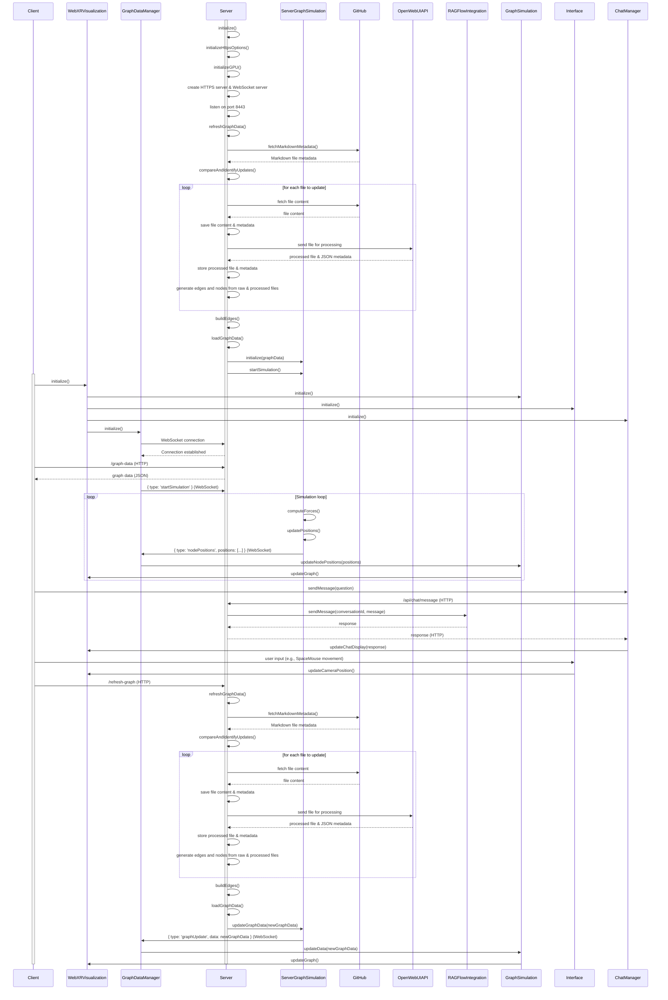

# WebXR Graph Visualization of Logseq Knowledge Graphs with RAGFlow Integration

This project visualizes privately hosted GitHub Markdown files created by LogSeq and integrates with RAGFlow for question answering capabilities.

This is my LogSeq personal knowledge base, which is about 10 months old. I am NOT a programmer, this was an AI project with Claude in the main, using Continue extension in VSCode. There will be issues, I have no doubt, but it's working out so far.


When I commit changes to the graph into a private GitHub repo it's automatically parsed for public pages and pushed to a website
https://narrativegoldmine.com/#/graph

The 2D graph seen there is fine, but a bit useless. I wanted something I can explore in mixed reality, and this project is the start of that. It pulls from the public labelled elements of the repo and creates a force-directed 3D graph using WebXR. It uses Three.js to render this graph in an immersive 3D space.


## Features

- Fetch and parse Markdown files from GitHub
- Generate nodes and edges based on Markdown content
- Render a 3D graph using WebXR and Three.js
- HTTPS setup with self-signed certificate
- Efficiently checks for file changes before downloading
- Randomize node positions with spacebar
- Color nodes based on hyperlink count
- GPU-accelerated force-directed graph layout with CPU fallback
- Dynamic node labeling for closer nodes
- Real-time updates via WebSocket
- Responsive design (handles window resizing)
- Debug overlay with node and edge counts and simulation type (CPU/GPU)
- Integration with RAGFlow for question answering capabilities

## Getting Started

### Prerequisites

- Docker
- Node.js
- GitHub Personal Access Token
- RAGFlow API Key

### Setup

1. **Clone the Repository:**
   ```bash
   git clone https://github.com/yourusername/webxr-graph.git
   cd webxr-graph
   ```

2. **Set up Environment Variables:** 
   Create a `.env` file in the root directory and add your GitHub access token and RAGFlow API key:
   ```
   GITHUB_ACCESS_TOKEN=your_token_here
   GITHUB_OWNER=your_github_username
   GITHUB_REPO=your_repo_name
   GITHUB_DIRECTORY=path/to/markdown/files
   RAGFLOW_API_KEY=your_ragflow_api_key_here
   RAGFLOW_BASE_URL=http://your_ragflow_base_url/v1/
   ```

3. **Build and Run with Docker:**
   ```bash
   ./start_docker.sh
   ```
   This script builds the Docker image and runs the container, mapping port 8443 and mounting the processed_files directory.

4. **Access the Application:** 
   Open a WebXR-compatible browser and navigate to `https://localhost:8443`

## Architecture

### Class Diagram


### Sequence Diagram



## Key Components

- `server.js`: Handles server-side operations, including GitHub API interactions, graph data processing, and RAGFlow API communication.
- `script.js`: Manages client-side WebXR visualization, user interactions, real-time updates, and chat interface.
- `GraphSimulation.js`: Handles the physics simulation for node positioning, supporting both GPU and CPU computations.

## Usage

- Use a WebXR-compatible browser to view the 3D graph.
- Press the spacebar to randomize node positions.
- Nodes are colored based on their hyperlink count, ranging from blue (low) to red (high).
- The simulation automatically switches between GPU and CPU based on device capabilities.
- Node labels become visible when the camera is close to them.
- Use WASD keys for camera movement in spoofed VR mode.
- Use the chat interface at the bottom of the screen to ask questions about the knowledge graph.

# TODO

## Features and Interactions

1. **Hand Interaction (VR/AR)**:
    - Implement hand tracking to allow users to grab and manipulate nodes in 3D space. 
    - Use pinch gestures to select nodes and make dragging intuitive.
    - Leverage hand models to show real-time interactions, enhancing immersion.

2. **Mouse Click and Drag (Desktop/Mobile)**:
    - Enable users to click and drag nodes using a mouse for desktop browsers.
    - Implement kinetic dragging, where nodes continue to move slightly after releasing them to simulate inertia.

3. **Pass-Through AR (Meta Quest 3)**:
    - Integrate pass-through AR to allow users to see their real-world environment while interacting with the graph.
    - Use spatial anchors to place nodes at fixed points in the user's environment, making the experience more tangible.

4. **Navigation Keys Improvement**:
    - Redefine navigation keys for ease of use and accessibility.
    - Allow customization of key bindings for user preferences.
    - Include smooth panning and zooming capabilities with keyboard shortcuts.

5. **Interactive Node Summaries**:
    - Allow users to double-click or shake a node to view a summary of the Markdown content.
    - Display the summary in a floating, draggable window within the 3D space.
    - Highlight and focus on the selected node, fading out non-related nodes to minimize clutter.

6. **Search and Filter Functionality**:
    - Integrate a search bar where users can type keywords to find and highlight specific nodes.
    - Implement filters to show or hide nodes based on tags or content type.

7. **Tags and Color Coding**:
    - Use tags to categorize nodes and color-code them for visual distinction.
    - Allow users to customize tag categories and corresponding colors.

8. **Audio Feedback and Narration**:
    - Add audio feedback for interactions (e.g., a subtle sound when grabbing or moving a node).
    - Implement text-to-speech for node summaries, where users can listen to the Markdown content instead of reading it.

9. **Collaborative Mode**:
    - Develop a multi-user mode where multiple users can interact with the same graph in real-time.
    - Allow users to see each other's hand movements and interactions (e.g., different colored hand representations).

10. **Heatmap Visualization**:
    - Implement heatmap functionalities to show the most interacted-with nodes.
    - Help users identify critical information quickly by visualizing interaction density.

11. **Bookmarking and Annotations**:
    - Allow users to bookmark nodes and add annotations to them.
    - Provide a side panel where users can view and edit their bookmarks and notes.

12. **Advanced Physics Simulation**:
   - Enhance node movements with more sophisticated physics, such as elastic and magnetic effects, to make the interactions feel more lifelike.
   - Adjust simulation parameters dynamically based on the size and complexity of the graph.

13. **Voice to Voice**:
    - Whisper MLX
    - Silero VAD v5
    - MeloTTS

14: **Chat with avatar**
   - Jarvis style head and shoulders interactive agent


## Performance Considerations

- The application uses object pooling for nodes and edges to optimize performance.
- GPU-accelerated force-directed graph layout is used when supported, with a fallback to CPU computation.
- Dynamic node labeling helps reduce rendering load for distant nodes.

## Debugging

- A debug overlay displays the current node count, edge count, and simulation type (GPU/CPU).
- Console logs provide detailed information about the initialization process and any errors encountered.

## Contributing

Contributions are welcome! Please feel free to submit a Pull Request.

## License

This project is licensed under the Creative Commons CC0 license.
```

This updated README reflects the current state of the project, including the RAGFlow integration for question answering capabilities. It updates the architecture diagrams to include the RAGFlow integration and modifies the setup instructions to include the RAGFlow API key. The usage section now mentions the chat interface, and the key components section has been updated to reflect the changes in server.js and script.js.
