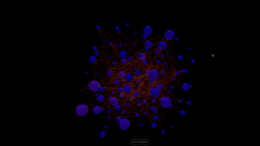
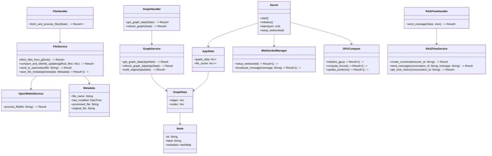
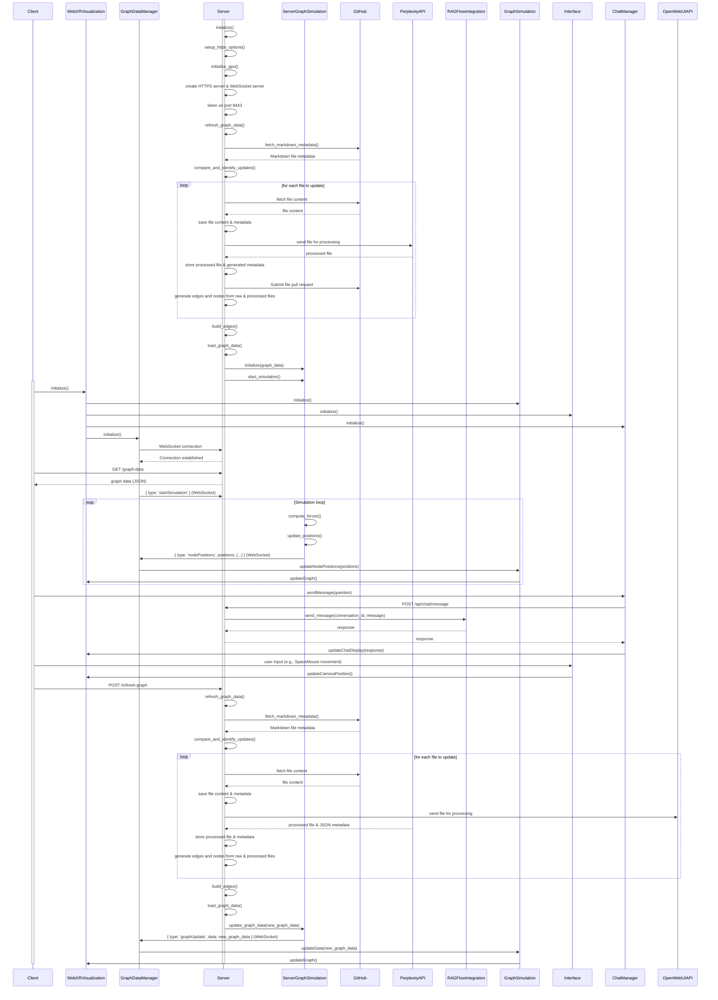

# WebXR Graph Visualization of Logseq Knowledge Graphs with RAGFlow Integration

This project visualises privately hosted GitHub Markdown files created by LogSeq and integrates with RAGFlow for question-answering capabilities in a 3D, WebXR-compatible environment.




## Project Overview

This application transforms a LogSeq personal knowledge base into an interactive 3D graph, viewable in mixed reality. It automatically parses pages from a private GitHub repository, and processes them via perplexity API to update and provide additional citations. These changes are submitted back to the source repo as PRs. It then builds it's own edge linkages between connected nodes, with edges as a function of the bidirectionsl references between any two nodes. Both processed and raw files are analysed, and JSON metadata is generated for both versions, enabling a comparison of graph nodes and edges. This figure is further nuanced by the richness of the citation and web links in the connected nodes. All this is combined into a force-directed 3D graph using WebXR and Three.js. The visual graph can be interrogated via Microsoft graphRAG in a text interface.

Key features include:
- **3D Visualisation** of knowledge graph nodes and edges
- **WebXR Compatibility** for immersive exploration
- **Rust calls to Perplexity AI** for file pre-processing
- **Integration with RAGFlow** for AI-powered question answering
- **Real-Time Updates** via WebSocket for both client and server
- **Mandatory GPU Acceleration** on the server-side for graph computations using WebGPU
- **Optional GPU Acceleration** on the client-side for enhanced performance
- **One-Time File Pre-Processing** for GitHub file updates, comparing processed and raw files

## Architecture

The project consists of a Rust-based server running in a Docker container and a JavaScript client-side application.

### Class Diagram



### Sequence Diagram



## File Structure

### Server-Side (Rust)

- **src/**
  - `main.rs`: Entry point for the Rust server
  - `app_state.rs`: Shared application state
  - `handlers/`
    - `graph_handler.rs`: Handles graph data requests
    - `file_handler.rs`: Manages file operations and GitHub interactions
    - `ragflow_handler.rs`: Handles RAGFlow API interactions
  - `services/`
    - `graph_service.rs`: Core graph processing and management
    - `file_service.rs`: File handling and OpenWebUI integration
    - `ragflow_service.rs`: RAGFlow conversation management
    - `perplexity_service.rs`: Interaction with Perplexity API
  - `models/`
    - `graph.rs`: Graph data structures
    - `metadata.rs`: File metadata representation
    - `node.rs`: Graph node structure
  - `utils/`
    - `websocket_manager.rs`: Server-side WebSocket management
    - `gpu_compute.rs`: GPU acceleration for server-side computations using WebGPU

### Client-Side (JavaScript)

- **Core**: `public/js/`
  - `index.js`: Entry point for client-side application
  - `app.js`: Main application setup and initialization

- **Components**: `public/js/components/`
  - `webXRVisualization.js`: Manages WebXR rendering and interactions
  - `graphSimulation.js`: Handles graph physics and layout
  - `interface.js`: User input handling
  - `chatManager.js`: Manages chat interface and RAGFlow interactions

- **Services**: `public/js/services/`
  - `graphDataManager.js`: Manages graph data and WebSocket communication
  - `websocketService.js`: Client-side WebSocket handling

- **ThreeJS Components**: `public/js/threeJS/`
  - `threeSetup.js`: Three.js scene initialization
  - `threeGraph.js`: Three.js graph rendering

- **XR Components**: `public/js/xr/`
  - `xrSetup.js`: WebXR session setup
  - `xrInteraction.js`: XR-specific interaction handling

- **Utilities**: `public/js/`
  - `gpuUtils.js`: Optional GPU acceleration for client-side computations

### Tests

Unit tests are provided for all major components, both on the server and client side, under the `tests` directory.

## Installation and Setup

### Prerequisites

- Docker with NVIDIA GPU support
- Rust (for local development)
- Node.js and npm (for local development)
- GitHub Personal Access Token
- RAGFlow API Key
- Perplexity API
- GPU-enabled server for mandatory server-side acceleration
- (Optional) GPU-enabled client device for enhanced performance

### Environment Setup

1. Clone the repository:
   ```bash
   git clone https://github.com/yourusername/webxr-graph.git
   cd webxr-graph
   ```

2. Create a `.env` file in the root directory:
   ```
   GITHUB_ACCESS_TOKEN=your_token_here
   GITHUB_OWNER=your_github_username
   GITHUB_REPO=your_repo_name
   GITHUB_DIRECTORY=path/to/markdown/files
   RAGFLOW_API_KEY=your_ragflow_api_key_here
   RAGFLOW_BASE_URL=http://your_ragflow_base_url/v1/
   OPENWEBUI_API=http://your_openwebui_url/
   ```

### Running with Docker

1. Build and run the Docker container:
   ```bash
   docker-compose up --build
   ```

2. Access the application at `https://localhost:8443` using a WebXR-compatible browser.

### Local Development


### Running Tests

- For Rust tests:
  ```bash
  cargo test
  ```

- For JavaScript tests:
  ```bash
  npm test
  ```

### Test Coverage

We have implemented comprehensive test coverage for both server-side and client-side components:

#### Server-side Tests (Rust)

- **Unit Tests**: Located in `tests/server/` directory
  - `app_state_test.rs`: Tests for AppState functionality
  - `metadata_test.rs`: Tests for Metadata struct and its methods
  - `file_handler_test.rs`: Tests for file handling operations
  - `graph_service_test.rs`: Tests for graph processing and management
  - `openwebui_service_test.rs`: Tests for OpenWebUI API interactions
  - `ragflow_service_test.rs`: Tests for RAGFlow service operations

- **Integration Tests**: Located in `tests/server/integration_tests.rs`
  - End-to-end workflow tests
  - Graph update workflow tests

#### Client-side Tests (JavaScript)

- Located in `tests/client/` directory
  - `interface.test.js`: Tests for user interface components
  - `graphService.test.js`: Tests for client-side graph data management
  - `websocketService.test.js`: Tests for WebSocket communication
  - ... (other client-side test files)

Our test suite follows best practices for Test-Driven Development (TDD):
- Extensive use of mocking for API interactions and external services
- Comprehensive coverage of both success and error scenarios
- Integration tests to ensure proper interaction between components

To run all tests and view coverage reports:

```bash
cargo test --all-features --no-fail-fast
npm run test -- --coverage
```


1. Install Rust dependencies:
   ```bash
   cargo build
   ```

2. Install JavaScript dependencies:
   ```bash
   npm install
   ```

3. Run the Rust server:
   ```bash
   cargo run
   ```

4. Serve the frontend (you may need to set up a separate web server)

### Running Tests

- For Rust tests:
  ```bash
  cargo test
  ```

- For JavaScript tests:
  ```bash
  npm test
  ```

## Development Status

The project is under active development. Areas of focus include:
- Optimising WebGPU integration for graph computations
- Finalising the integration with OpenWebUI for file processing
- Expanding unit tests and improving test coverage
- Enhancing the Rust-based server performance

## Contributing

Contributions are welcome! Please submit issues or pull requests.

## License

This project is licensed under the Creative Commons CC0 license.

---


## Development Status

The project is under active development. Recent improvements include:
- Enhanced test coverage for both server-side and client-side components
- Implementation of integration tests for end-to-end workflows
- Improved mocking for API interactions in OpenWebUiService and RAGFlowService

Areas of ongoing focus include:
- Optimising WebGPU integration for graph computations
- Finalising the integration with OpenWebUI for file processing
- Expanding unit tests and improving test coverage
- Enhancing the Rust-based server performance
