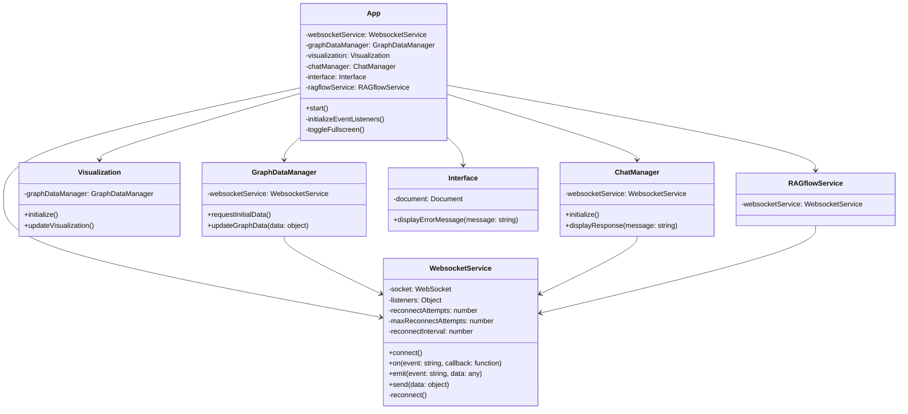
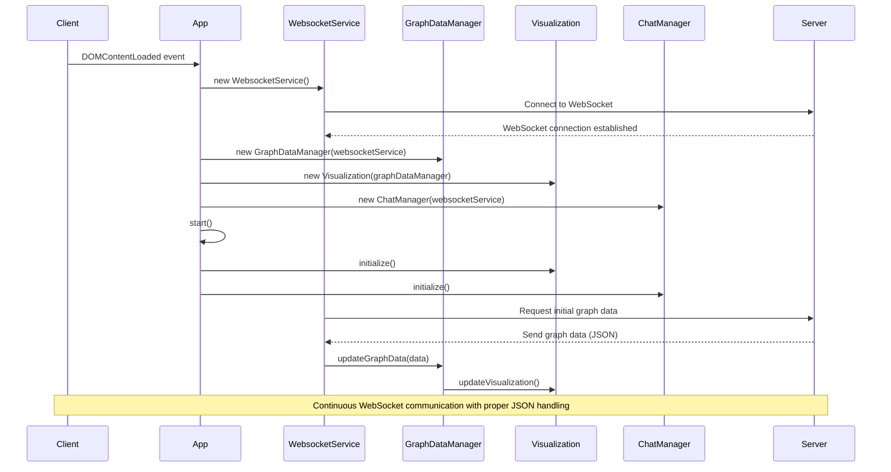

# WebXR Graph Visualization of Logseq Knowledge Graphs with RAGFlow Integration


## Project Overview

This application transforms a LogSeq personal knowledge base into an interactive 3D graph, viewable in mixed reality environments. It automatically parses Markdown files from a privately hosted GitHub repository, processes them via the Perplexity AI API to enhance content, and integrates with RAGFlow for AI-powered question answering. Changes are submitted back to the source repository as pull requests (PRs). The system builds its own edge linkages between connected nodes based on bidirectional references, generating both processed and raw JSON metadata for comparison. This rich metadata, combined with citation and web link data, is visualised using a force-directed 3D graph with WebXR and Three.js. The visual graph can be interactively explored across desktop and immersive AR devices, with real-time updates facilitated by WebSockets.

**Key features include:**

- **3D Visualisation** of knowledge graph nodes and edges with real-time updates
- **WebXR Compatibility** for immersive exploration on AR and VR devices
- **Efficient WebSocket Communication** for dynamic node position updates
- **GPU Acceleration** on both server and client sides for enhanced performance
- **Node Labels as Billboards** for clear and interactive node identification
- **Integration with RAGFlow** for AI-powered question answering within the graph interface
- **Spacemouse Support** for intuitive navigation in immersive environments
- **Automatic GitHub PR Submissions** for processed content updates
- **Comprehensive Metadata Management** for both processed and raw files

## Recent Updates

We've made several important updates to improve the codebase and resolve some issues:

1. **Edge Struct Refactoring**: 
   - Changed the `target` field to `target_node` in both the `Edge` and `GPUEdge` structs.
   - This change affects the following files:
     - `src/models/edge.rs`
     - `src/services/graph_service.rs`
     - `data/public/js/components/visualization.js`

2. **GPU Shader Compatibility**:
   - Updated the GPU shader code to use `target_node` instead of `target`.
   - This change affects the `src/utils/force_calculation.wgsl` file.

3. **Client-side Visualization Updates**:
   - Modified the JavaScript visualization code to use `edge.target_node` instead of `edge.target` when creating and updating edge objects.

These changes resolve naming conflicts with reserved keywords in the GPU shader code and ensure consistency across the entire codebase. The updates improve the overall stability and maintainability of the application.

## Architecture

The project comprises a Rust-based server running in a Docker container and a JavaScript client-side application. The architecture has been enhanced to support GPU acceleration, efficient real-time updates, and immersive AR experiences.

## Current System State and Error Analysis

Based on the latest client-side errors, we've updated our understanding of the system's current state. Here are the updated class and sequence diagrams, along with an analysis of the observed errors.

### Updated Class Diagram



### Updated Sequence Diagram



## WebSocket Communication

We have implemented significant improvements to the WebSocket communication between the client and server. These changes enhance the reliability, error handling, and overall robustness of the real-time data exchange.

### Client-side Improvements (WebsocketService)

1. **Enhanced Error Handling**: The client now properly handles JSON parsing errors and emits detailed error information.
2. **Reconnection Logic**: Implemented an automatic reconnection mechanism with a configurable number of attempts and interval.
3. **Improved Logging**: Added more comprehensive logging for connection status, errors, and message handling.

### Server-side Improvements (WebSocket Manager)

1. **JSON Parsing**: The server now expects and handles JSON-formatted messages from clients.
2. **Structured Responses**: All server responses are now sent as properly formatted JSON objects.
3. **Error Handling**: Improved error handling for invalid JSON messages and other potential issues.

### WebSocket Message Format

All WebSocket messages now follow a structured JSON format:

```json
{
  "type": "message_type",
  "data": {
    // Message-specific data
  }
}
```

Common message types include:

- `"graph_update"`: For sending graph data updates
- `"chat_message"`: For chat-related communications
- `"error"`: For sending error information

### Error Handling

Both client and server now handle WebSocket errors more gracefully:

- Connection errors trigger reconnection attempts on the client side.
- JSON parsing errors are logged and don't crash the application.
- The server sends structured error messages for invalid requests.

### Reconnection Strategy

The client implements an exponential backoff strategy for reconnections:

- Initial reconnection attempt occurs after 5 seconds.
- Subsequent attempts increase the delay, up to a maximum of 5 attempts.
- Users are notified of connection status through the UI.

These improvements significantly enhance the reliability and user experience of the real-time aspects of the application, ensuring smoother operation of the 3D graph visualization and chat features.

## File Structure

[... rest of the README content remains unchanged ...]
