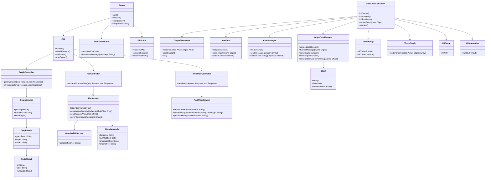
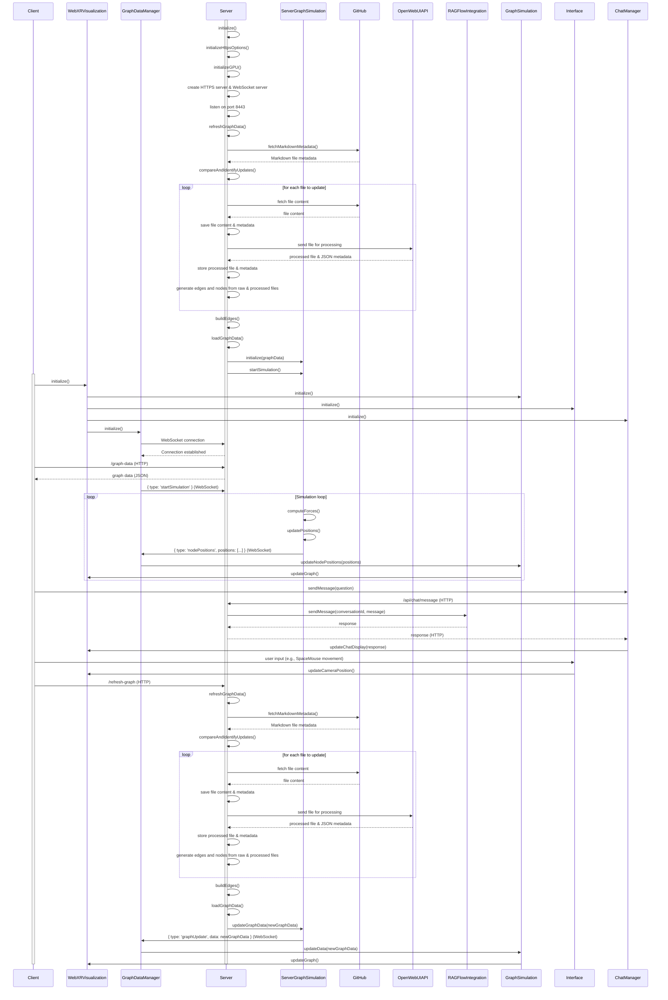

# WebXR Graph Visualization of Logseq Knowledge Graphs with RAGFlow Integration

This project visualizes privately hosted GitHub Markdown files created by LogSeq and integrates with RAGFlow for question answering capabilities in a 3D, WebXR-compatible environment.


## Project Overview

This application transforms a LogSeq personal knowledge base into an interactive 3D graph, viewable in mixed reality. It automatically parses pages from a private GitHub repository, processes them via OpenWebUI, and creates a force-directed 3D graph using WebXR and Three.js. The processed and raw files are analyzed, and JSON metadata is generated for both versions, enabling a comparison of graph nodes and edges.

Key features include:
- **3D Visualization** of knowledge graph nodes and edges
- **WebXR Compatibility** for immersive exploration
- **OpenWebUI API Integration** for file pre-processing
- **Integration with RAGFlow** for AI-powered question answering
- **Real-Time Updates** via WebSocket
- **GPU-Accelerated** graph layout with CPU fallback
- **One-Time File Pre-Processing** for GitHub file updates, comparing processed and raw files.

## Architecture

The project consists of server-side and client-side components, with well-defined classes and services based on the diagram below:

### Class Diagram



### Sequence Diagram



## File Structure

The project is divided into two main components: server-side and client-side. Here’s the file structure generated by the setup script.

### Server-Side

- **Controllers**: Handles incoming HTTP requests.
  - `GraphController`: Fetches graph data.
  - `FileController`: Fetches and processes files from GitHub.
  - `RAGFlowController`: Manages interactions with RAGFlow API.
  
- **Services**: Core business logic.
  - `GraphService`: Builds and updates the graph.
  - `FileService`: Fetches and processes files from GitHub and OpenWebUI.
  - `RAGFlowService`: Manages conversation with RAGFlow.
  
- **Models**: Data structures representing nodes, graphs, and metadata.
  - `GraphModel`, `MetadataModel`, `NodeModel`
  
- **Utilities**: Helper functions.
  - `WebSocketUtils`, `GPUUtils`

### Client-Side

- **WebXRVisualization**: Manages rendering and WebXR integration.
- **GraphSimulation**: Simulates the graph’s

 physics and layout.
- **Interface**: Handles user input.
- **ChatManager**: Manages chat and interaction with RAGFlow.
- **GraphDataManager**: Manages WebSocket communication.
- **ThreeJS Components**: Handles the Three.js scene setup and rendering.
  - `ThreeSetup`, `ThreeGraph`
  
### Tests

Unit tests are provided for all major components, both on the server and client side, under the `tests` directory.

## Installation and Setup

### Prerequisites

- Docker
- Node.js
- GitHub Personal Access Token
- RAGFlow API Key
- OpenWebUI API

### Environment Setup

1. Clone the repository:
   ```bash
   git clone https://github.com/yourusername/webxr-graph.git
   cd webxr-graph
   ```

2. Create a `.env` file in the root directory:
   ```
   GITHUB_ACCESS_TOKEN=your_token_here
   GITHUB_OWNER=your_github_username
   GITHUB_REPO=your_repo_name
   GITHUB_DIRECTORY=path/to/markdown/files
   RAGFLOW_API_KEY=your_ragflow_api_key_here
   RAGFLOW_BASE_URL=http://your_ragflow_base_url/v1/
   OPENWEBUI_API=http://your_openwebui_url/
   ```

3. Build and run with Docker:
   ```bash
   ./start_docker.sh
   ```

4. Access the application at `https://localhost:8443` using a WebXR-compatible browser.

## Development Status

The project is under active development. Areas of focus include:
- Finalizing the integration with OpenWebUI for file processing.
- Expanding unit tests and improving test coverage.
- Optimizing the GPU-based graph simulation for larger datasets.

## Contributing

Contributions are welcome! Please submit issues or pull requests.

## License

This project is licensed under the Creative Commons CC0 license.

---

This updated `README.md` reflects the architecture and design changes, including the OpenWebUI integration and the separation of concerns across various components. Let me know if you’d like to refine anything further!
