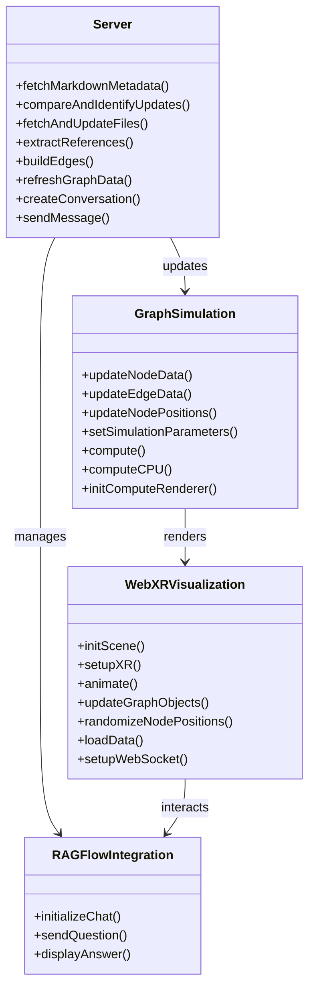
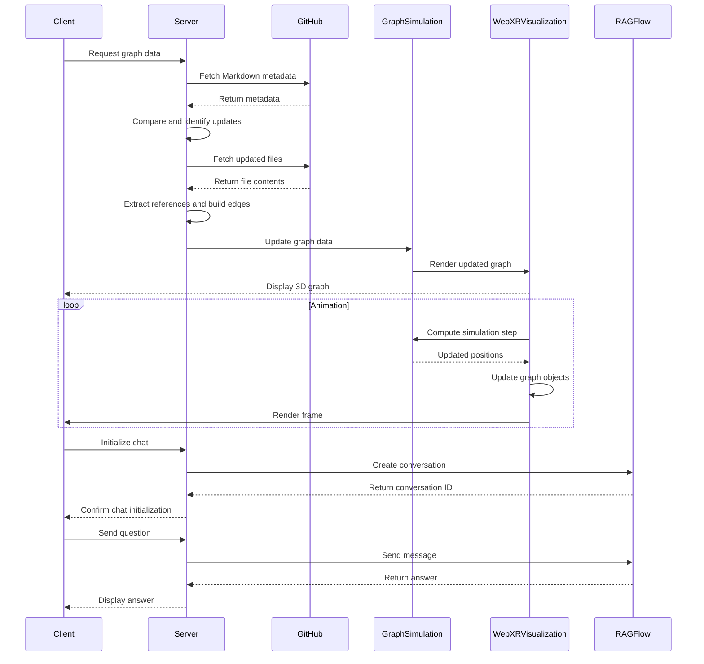

Based on the current context and the changes we've made, here's an updated version of the README.md:

```markdown
# WebXR Graph Visualization of Logseq Knowledge Graphs with RAGFlow Integration

This project visualizes privately hosted GitHub Markdown files created by LogSeq and integrates with RAGFlow for question answering capabilities.

This is my LogSeq personal knowledge base, which is about 10 months old. I am NOT a programmer, this was an AI project with Claude in the main, using Continue extension in VSCode. There will be issues, I have no doubt, but it's working out so far.


When I commit changes to the graph into a private GitHub repo it's automatically parsed for public pages and pushed to a website
https://narrativegoldmine.com/#/graph

The 2D graph seen there is fine, but a bit useless. I wanted something I can explore in mixed reality, and this project is the start of that. It pulls from the public labelled elements of the repo and creates a force-directed 3D graph using WebXR. It uses Three.js to render this graph in an immersive 3D space.


## Features

- Fetch and parse Markdown files from GitHub
- Generate nodes and edges based on Markdown content
- Render a 3D graph using WebXR and Three.js
- HTTPS setup with self-signed certificate
- Efficiently checks for file changes before downloading
- Randomize node positions with spacebar
- Color nodes based on hyperlink count
- GPU-accelerated force-directed graph layout with CPU fallback
- Dynamic node labeling for closer nodes
- Real-time updates via WebSocket
- Responsive design (handles window resizing)
- Debug overlay with node and edge counts and simulation type (CPU/GPU)
- Integration with RAGFlow for question answering capabilities

## Getting Started

### Prerequisites

- Docker
- Node.js
- GitHub Personal Access Token
- RAGFlow API Key

### Setup

1. **Clone the Repository:**
   ```bash
   git clone https://github.com/yourusername/webxr-graph.git
   cd webxr-graph
   ```

2. **Set up Environment Variables:** 
   Create a `.env` file in the root directory and add your GitHub access token and RAGFlow API key:
   ```
   GITHUB_ACCESS_TOKEN=your_token_here
   GITHUB_OWNER=your_github_username
   GITHUB_REPO=your_repo_name
   GITHUB_DIRECTORY=path/to/markdown/files
   RAGFLOW_API_KEY=your_ragflow_api_key_here
   RAGFLOW_BASE_URL=http://your_ragflow_base_url/v1/
   ```

3. **Build and Run with Docker:**
   ```bash
   ./start_docker.sh
   ```
   This script builds the Docker image and runs the container, mapping port 8443 and mounting the processed_files directory.

4. **Access the Application:** 
   Open a WebXR-compatible browser and navigate to `https://localhost:8443`

## Architecture

### Class Diagram



### Sequence Diagram



## Key Components

- `server.js`: Handles server-side operations, including GitHub API interactions, graph data processing, and RAGFlow API communication.
- `script.js`: Manages client-side WebXR visualization, user interactions, real-time updates, and chat interface.
- `GraphSimulation.js`: Handles the physics simulation for node positioning, supporting both GPU and CPU computations.

## Usage

- Use a WebXR-compatible browser to view the 3D graph.
- Press the spacebar to randomize node positions.
- Nodes are colored based on their hyperlink count, ranging from blue (low) to red (high).
- The simulation automatically switches between GPU and CPU based on device capabilities.
- Node labels become visible when the camera is close to them.
- Use WASD keys for camera movement in spoofed VR mode.
- Use the chat interface at the bottom of the screen to ask questions about the knowledge graph.

## Performance Considerations

- The application uses object pooling for nodes and edges to optimize performance.
- GPU-accelerated force-directed graph layout is used when supported, with a fallback to CPU computation.
- Dynamic node labeling helps reduce rendering load for distant nodes.

## Debugging

- A debug overlay displays the current node count, edge count, and simulation type (GPU/CPU).
- Console logs provide detailed information about the initialization process and any errors encountered.

## Contributing

Contributions are welcome! Please feel free to submit a Pull Request.

## License

This project is licensed under the Creative Commons CC0 license.
```

This updated README reflects the current state of the project, including the RAGFlow integration for question answering capabilities. It updates the architecture diagrams to include the RAGFlow integration and modifies the setup instructions to include the RAGFlow API key. The usage section now mentions the chat interface, and the key components section has been updated to reflect the changes in server.js and script.js.